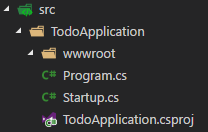
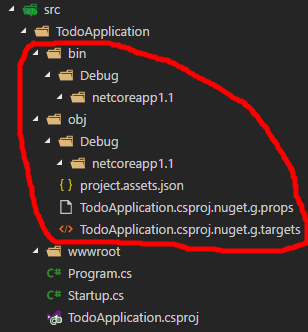
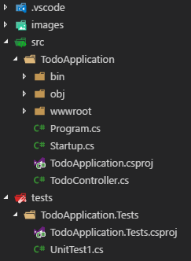
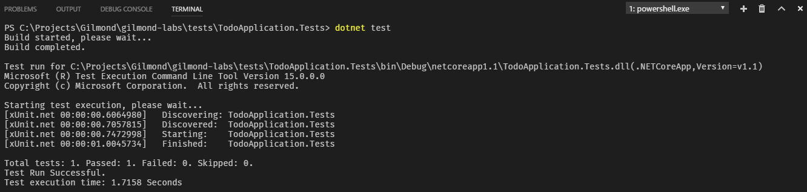

# ASP.Net MVC
---

This lab demonstrates the fundamental concepts of both MVC as a web technology stack, and also the UI Design Pattern the tech stack is named after.

## Overview

In this lab you will create a simple API that allows the management of a *Todo List* using ASP.Net Core with MVC. You'll create the projects from scratch, look at mechanisms for testing your code, catering for TDD.

### Notes

 * *Data*: All the data for the todo lists will be held in-memory, so any changes to data will be lost when the application restarts.
 * *Seed*: The lab will predefine a couple _Todo_ items in accordance with this guide. By getting your application running, you'll actually be able to tick things off your list!
 * *IDE*: This lab *can* be completed in Visual Studio, but for web development I recommend using VS Code. The reason being, web development moves very fast, much faster than some of us are used to. Visual Studio is a massive codebase and the VS Team simply can't keep up with changes to the web ecosystem. VS Code however is much more leightweight and nimble; whilst still not (typically) supporting bleeding edge development, it will always be more likely to cater for the web ecosystem as significant changes occur.

### VS Code Basics

For those of you that haven't used VS Code *in anger*, the most important key is `F1`, which displays the *Command Pallette*. From here you'll find numerous commands you can run from within VS Code, saving you from having to switch to Visual Studio, GitKraken/SourceTree, Command Line, and so forth.

Most of the common commands have a key binding by default. In instructions below I'll provide first the key binding, and then the command name, so you can choose which method you prefer. For example:

* Press `Ctrl + K, Ctrl + O` *(`Files: Open Folder`)* to Open a Folder

In this example, you can either use the shortcut, or press `F1` and search for the text provided in parenthesis - it's a free text search so you can just type `folder` and no doubt see the command towards the top of the list of options.

For those accustomed to *Visual Studio*, please bear in mind the following points as they are often the cause of problems when following this lab:

 * *VS Code* does **not** save all your pending changes when you Build. Make sure you save your changes.
 * *VS Code* does not auto-restore NuGet packages when you change package references. Make sure you `dotnet restore` if you encounter NuGet problems.

## Part 1: Setup

In this part you will add a new project configured to run as an ASP.Net Core web site.

There are many ways to create new projects, the most common for most people is to use `File` -> `New` in Visual Studio. However, seeing as I've recommended using VS Code...

 * Press `Ctrl + K, Ctrl + O` *(Files: Open Folder)* and navigate to or create the folder you want to work in for the duration of this lab.
 * Press `Ctrl + Shift + '` *(`Terminal: Create new integrated Terminal`)* to bring up the terminal.
   * Ensure the terminal has opened the in the directory you want. If it hasn't navigate to it using `cd`.
 * In the terminal, type `mkdir src` to make a `src` directory, and then navigate to it in the terminal with `cd src`.
   * At Gilmond we try to follow [best practice](https://gist.github.com/davidfowl/ed7564297c61fe9ab814) with regards to solution layout.
 * In the terminal, type `mkdir TodoApplication` to make a `TodoApplication` directory, and then navigate to it in the terminal with `cd TodoApplication`.
 * In the terminal, type `dotnet new web` to create a new Empty Web Project.
   * The `dotnet new` command can create several templates by default, as [listed here](https://docs.microsoft.com/en-us/dotnet/articles/core/tools/dotnet-new).
   * The `dotnet new` command assumes the directory you're in to be the name of the application, so it will create a `TodoApplication.csproj` and namespace the other files accordingly.

Your directory structure should now be:



Congratulations, you now have a .Net Core website. Open either the `Program.cs` or `Startup.cs` files. If the *OmniSharp* extension isn't installed in your VS Code already, you'll be prompted at this stage to install the C# extension and then reload VS Code.

If / once *Omnisharp* is installed, when you open one of the `*.cs` files you may be prompted to restore dependencies. Simply accept the prompts, which should leave you with a built application (`bin` and `obj` directories will be added automatically):



You can now press `F5` *(`Debug: Start Debugging`)* to run your web site and launch a browser tab which should load the default *"Hello World" Middleware* created when you ran `dotnet new`.

> **How does that work?**
>
> ---
>
> In previous versions of ASP.Net, running your application from Visual Studio would start a development server such as _IIS Express_ or _Cassini_, which would sit in your taskbar and host your web application. That is not the case for ASP.Net Core.
>
> The `Microsoft.AspNetCore` NuGet package is referenced by default, which amongst other packages, brings in the `Microsoft.AspNetCore.Server.IISIntegration` and `Microsoft.AspNetCore.Server.Kestrel` packages. The former allows your application to run on IIS, the latter however is a relatively new, high-performance cross-platform server.
>
> In your auto-generated `Startup.cs` file, you can see that your code creates a `WebHostBuilder` that uses both IIS Integration and Kestrel (which means your application can be hosted by either web server). When you hit `F5` to run your code, VS Code looks at (and auto-generates if required) a `launch.json` file in the `.vscode` directory, which will launch the Kestrel server by default.
>
> ASP.Net Core will, as defined in the `Program.cs` file, use your `Startup` class. These `Startup` files don't need to implement any interfaces, but they must follow [certain conventions](https://docs.microsoft.com/en-us/aspnet/core/fundamentals/startup). Your `ConfigureServices` method will be called, allowing you to define which services your application requires (and can therefore dependency inject). After which, your `Configure` method will be called (the parameters to which can be dependency injected), allowing you to define your [Middleware](https://docs.microsoft.com/en-us/aspnet/core/fundamentals/middleware). By default, the template generated a single, very simple middleware that simply prints "Hello World".
>
> In the next section we'll see how we can replace and extend this behaviour using the MVC Middleware.

## Part 2: Controller

The first step in extending our application is adding a test project. Follow the steps above and run `dotnet new xunit` in the `./tests/TodoApplication.Tests/` directory (which you'll need to create).



The test project needs to reference our web application, so in the terminal, run the following command from the `TodoApplication.Tests` directory:

```cmd
dotnet add reference ../../src/TodoApplication/TodoApplication.csproj
```

Our first goal is to confirm that we can return a list of *Todo Items*. For now, we'll use _Unit Tests_.

### Unit Testing

 * Rename the auto-generated `UnitTest1.cs` to `TodoControllerTests.cs`
 * Correct the `UnitTest1` class name.
 * Add the following test:

```csharp
[Fact]
public async Task GetAllReturnsAllTodos()
{
	var data = new[] { new Todo { Text = "Test Todo" } };
	var mockRepo = new Mock<TodoRepository>();
	mockRepo
		.Setup(repo => repo.GetAllAsync())
		.ReturnsAsync(data);
	var controller = new TodoController(mockRepo.Object);

	var result = await controller.GetAll();

	var jsonResult = result.Should().BeOfType<JsonResult>().Subject;
	jsonResult.Value.Should().Be(data);
}
```

Clearly, most of this won't compile yet, but hopefully the intent is clear. We create some fake data, and expect the controller to return this data wrapped in a `JsonResult` when we call `GetAll`.

A Test that won't compile is simply a *Failing Test*, so let's get our test to pass:

 * In the `TodoApplication` directory, add the file `Todo.cs` with the following content:

```csharp
namespace TodoApplication
{
	public class Todo
	{
		public string Text { get; set; }
		public bool IsComplete { get; set;}
	}
}
```

 * Add the `Moq` and `FluentAssertions` *NuGet package references* and then restore them using the following commands in the terminal, from the `TodoApplication.Tests` directory:

```cmd
dotnet add package Moq
dotnet add package FluentAssertions
dotnet restore
```

 * Add `using` statements to your `TodoControllerTests` file for `Moq` and `FluentAssertions`.

With all our test dependencies in place, it's time to add our actual Controller code: 

 * Add a new class to the `TodoApplication` project called `TodoController.cs`.
 * Add a constructor to the class which accepts a `TodoRepository` argument.
 * Store the injected `TodoRepository` in a `private readonly` field.
 * Add a method called `GetAll` to your new controller class.
 * Fetch the data from your repository (using async/await).
 * Return the data within a `JsonResult`.

The controller should now look something like:

```csharp
using Microsoft.AspNetCore.Mvc;
using System.Collections.Generic;
using System.Threading.Tasks;

namespace TodoApplication
{
	public class TodoController
	{
		private readonly TodoRepository _repository;

		public TodoController(TodoRepository repository)
			=> _repository = repository;

		public async Task<IActionResult> GetAll()
		{
			var data = await _repository.GetAllAsync();
			return new JsonResult(data);
		}
	}
}
```

Again, this method doesn't compile because `IActionResult`, `TodoRepository`, and `JsonResult` are not defined. To resolve the `IActionResult` error:

 * As per previous instructions, add a *NuGet package reference* to `Microsoft.AspNetCore.Mvc.Core` from the `TodoApplication` directory and restore it.

> _**Note**: [Security Advisory 4021279](https://github.com/aspnet/Announcements/issues/239) was recently announced. At time of writing, the tooling that created your web application does not use the secured version of `Microsoft.AspNetCore` when generating new projects from templates. If you're using version `1.1.1`, please update this to `1.1.2` by editing the `TodoApplication.csproj` file as shown below:_
>
>```xml
> <ItemGroup>
>   <PackageReference Include="Microsoft.AspNetCore" Version="1.1.2" />
>   <!-- other nuget packages.... -->
> </ItemGroup>
>```

To resolve the `TodoRepository` error:

 * Add a `TodoRepository.cs` file to the `TodoApplication`.
 * Add the following content to the `TodoRepository` file:
    * Note: We've added methods you don't require until later in this lab for simplicity.

```csharp
using System.Collections.Generic;
using System.Threading.Tasks;

namespace TodoApplication
{
	public interface TodoRepository
	{
		/// <summary>
		/// Return all <see cref="Todo"/>s, including those completed.
		/// </summary>
		/// <returns>Returns empty collection if none present</returns>
		Task<ICollection<Todo>> GetAllAsync();
		/// <summary>
		/// Fetch the <see cref="Todo"/> matching the specified <paramref name="id"/>
		/// </summary>
		/// <returns>null if matching <see cref="Todo"/> not found.</returns>
		Task<Todo> GetSingleAsync(int id);
		/// <summary>
		/// Adds the Todo
		/// </summary>
		/// <returns>ID of the created <see cref="Todo"/></returns>
		Task<int> AddAsync(Todo todo);
		/// <summary>
		/// Replaces the <see cref="Todo"/> with a matching <paramref name="id">
		/// </summary>
		/// <returns>false if unable to update</returns>
		Task<bool> UpdateAsync(int id, Todo todo);
	}
}
```

Now add a *NuGet package reference* to `Microsoft.AspNetCore.Mvc.Formatters.Json` in the `TodoApplication` and `dotnet restore` it *(careful, last time you used the terminal you were in the Tests directory)*.

Finally, run the test by running the command `dotnet test` in the terminal, from the `TodoApplication.Tests` directory.

> _**Troubleshooting**: If your test doesn't compile, ensure you have all the necessary usings:_
>
>```csharp
>using FluentAssertions;
>using Microsoft.AspNetCore.Mvc;
>using Moq;
>using System;
>using System.Collections.Generic;
>using System.Threading.Tasks;
>using Xunit;
>```



Unfortunately, this does not mean that our API is accessible yet. Indeed, if you press `F5` *(`Debug: Start Debugging`)* and navigate to `http://localhost:5000/todo/getall` you'll find your application errors. To resolve this we'll introduce integration tests.

### Integration Testing

Whilst we've confirmed that our code seems to work as intended, we can use an integration test to confirm that all of our components, when combined together with all of our dependencies such as Microsoft's MVC stack, work as intended:

 * Add a new test to your `TodoControllerTests` file:

```csharp
private const string TodoJson = "[{\"text\":\"Add 'Complete Todo' API\",\"isComplete\":false},{\"text\":\"Add 'New Todo' API\",\"isComplete\":false},{\"text\":\"Correct Todo Controller Routing\",\"isComplete\":false},{\"text\":\"Integration Test Todo Controller\",\"isComplete\":false},{\"text\":\"Unit Test Todo Controller\",\"isComplete\":true},{\"text\":\"Setup Projects\",\"isComplete\":true}]";
[Fact]
public async Task GetAllRequestReturnsAllTodosInJson()
{
	var server = new TestServer(new WebHostBuilder()
		.UseStartup<Startup>());
	var client = server.CreateClient();

	var response = await client.GetAsync("/todo/getall");

	response.StatusCode.Should().Be(HttpStatusCode.OK);
	var content = await response.Content.ReadAsStringAsync();
	content.Should().Be(TodoJson);
}
```

Again, this test won't compile immediately so let's resolve that.

 * Add a using for `Microsoft.AspNetCore.Hosting`.
 * Add a NuGet package reference to `Microsoft.AspNetCore.TestHost`.
 * Restore your NuGet packages.
 * Add a using for `Microsoft.AspNetCore.TestHost`.
 * Add a using for `System.Net`.

With our test now compiling we can start resolving any errors that occur when running the test. If you examine the output of `dotnet test`, you'll see that the first problem is:

`Expected object to be OK, but found NotFound`

This output is saying that when we tried to make a `GET` request to `/todo/getall`, the server responded with a HTTP Status 404 `NotFound`, which means the web server was not able to find our controller.

To enable our controllers to work, we'll first need to enable MVC on our website:

 * Add MVC to the `IServiceCollection` in `Startup.cs`:

```csharp
public void ConfigureServices(IServiceCollection services)
{
	services.AddMvcCore();
}
```

> _**Note**: Most applications would reference and Add the full `Microsoft.AspNetCore.Mvc` package instead of the `*.Core` package. However, the new ASP.Net stack is very granular, so we're taking the stance here of only pulling in the minimal amount of dependencies._

> _**Note**: Once ASP.Net Core 2.0 is released (at time of writing is in `preview1-final`), this granular dependency management will no longer be necessary. Instead, you'll simply add a single package reference to `Microsoft.AspNetCore.All` which will add **all** nuget packages to your project. When you publish your application, any dependencies you don't need will simply be excluded from the publish output._

  * Replace the *"Hello World"* Middleware with the MVC Middleware in `Startup.cs`, enabling the default route:

```csharp
public void Configure(IApplicationBuilder app, IHostingEnvironment env, ILoggerFactory loggerFactory)
{
	loggerFactory.AddConsole();

	if (env.IsDevelopment())
		app.UseDeveloperExceptionPage();

	app.UseMvcWithDefaultRoute();
}
```

With this complete, MVC should be able to locate our controller and route requests to it. Running `dotnet test` again will highlight the next problem with our application:

`Unable to resolve service for type 'TodoRepository' while attempting to activate 'TodoApplication.TodoController'`

Of course. Earlier we added the `TodoRepository` interface but never added an implementation. For simplicity, add the following content to a new `InMemoryTodoRepository.cs` file in the `TodoApplication` directory:

```csharp
using System;
using System.Collections.Concurrent;
using System.Collections.Generic;
using System.Linq;
using System.Threading;
using System.Threading.Tasks;

namespace TodoApplication
{
	internal sealed class InMemoryTodoRepository : TodoRepository
	{
		private readonly ConcurrentDictionary<int, Todo> _todos;

		private static readonly IEnumerable<Todo> Seed = new[] {
			new Todo { Text = "Setup Projects", IsComplete = true },
			new Todo { Text = "Unit Test Todo Controller", IsComplete = true},
			new Todo { Text = "Integration Test Todo Controller"},
			new Todo { Text = "Correct Todo Controller Routing"},
			new Todo { Text = "Add 'Get Single' API"},
			new Todo { Text = "Add 'New Todo' API" },
			new Todo { Text = "Add 'Complete Todo' API" }
		};
		private int _nextId;

		public InMemoryTodoRepository()
			=> _todos = new ConcurrentDictionary<int, Todo>(Seed
				.ToDictionary(x => Interlocked.Increment(ref _nextId), x => x));

		public Task<ICollection<Todo>> GetAllAsync()
			=> Task.FromResult(_todos.Values);

		public Task<Todo> GetSingleAsync(int id)
		{
			if (_todos.TryGetValue(id, out var todo))
				return Task.FromResult(todo);
			return Task.FromResult<Todo>(null);
		} 

		public Task<int> AddAsync(Todo todo)
		{
			var id = Interlocked.Increment(ref _nextId);
			if (_todos.TryAdd(id, todo))
				return Task.FromResult(id);
			throw new NotImplementedException("Erm... that's weird.");
		}

		public Task<bool> UpdateAsync(int id, Todo todo)
		{
			if (_todos.TryGetValue(id, out var original))
				return Task.FromResult(_todos.TryUpdate(id, original, todo));
			return Task.FromResult(false);
		}
	}
}
```

 * In `Startup.cs`, bind our in-memory implementation as a Singleton, in the `ConfigureServices` method:

 ```
public void ConfigureServices(IServiceCollection services)
{
	services.AddMvcCore();
	services.AddSingleton<TodoRepository, InMemoryTodoRepository>();
}
 ```

This should resolve our the second test error. Examing the output of `dotnet test` again, we can see:

`System.InvalidOperationException : No service for type 'Microsoft.AspNetCore.Mvc.Formatters.Json.Internal.JsonResultExecutor' has been registered.`

Whilst we did add a NuGet package reference to `Microsoft.AspNetCore.Mvc.Formatters.Json` earlier in this lab to get access to the `JsonResult` class, we never added it to the services. Do that now by editing the `ConfigureServices` method again:

 ```
public void ConfigureServices(IServiceCollection services)
{
	services.AddMvcCore()
		.AddJsonFormatters();
	services.AddSingleton<TodoRepository, InMemoryTodoRepository>();
}
 ```

You should now have two passing tests. Hit `F5` *(`Debug: Start Debugging`)*  and navigate to `http://localhost:5000/todo/getall` in your browser. You should see your data returned having been _JSON serialized_. 

Congratulations, you just made an *ASP.Net Core API*!

> **How does that work?**
>
> ---
>
>There are two parts of *MVC Magic* that allowed the above example to work with minimal configuration.
>
> **Controller Conventions**
>
>The MVC stack has several conventions which might make getting things running simple and quick, but they can also allude to a feeling of *what is this black magic?!*.
>
>In part 2, we added something called a `POCO Controller` (the `TodoController`). MVC uses two mechanisms to locate your controllers:
>
> * Any class that's name ends with `Controller` is considered a candidate (and known as a *POCO* Controller).
> * Any class that inherits from `Microsoft.AspNetCore.Mvc.Controller`, regardless of it's name, is considerd a candidate (and is known as a normal/standard controller).
>
>You'll often see controllers placed inside a `Controllers` folder within MVC projects, which is also considered a *convention*, but it is a **non-functional convention** that simply exists to make it easier for other developers to work with your code.
>
> **Default Routing**
>
>When we added the MVC middleware earlier, we specified we wanted to use the *Default Route*. This route is typically expressed as:
>
>```
>url: "{controller}/{action}/{id}",
>defaults: new { controller = "Home", action = "Index", id = UrlParameter.Optional 
>```
>
>After discovering your controllers, MVC will automatically map the controller's name (excluding the word `Controller` itself) to the `{controller}` section of the above route. Similarly, it will map the names of your methods within that controller to the `{action}` section of that route. 
>
>The second line shown above specifies that if a request is made that does not include the `{action}` section, then the assumption is made that it wants the method called `Index`. Similarly, if no `{controller}` section is present in the URL, then MVC will look for a controller called `Home` (consider this to be like *optional parameters*).
>
>Therefore, if you create a controller called `HomeController` with a method called `Index`, this method would be called whenever somebody goes to your root URL (i.e. http://localhost:5000).
>
>In the next section we'll see how we can modify the default route to better implement a [REST API](https://en.wikipedia.org/wiki/Representational_state_transfer).

## Part 3: Routing

_Routing_ is the term used to describe the process of working out what code should run given a Web Request. There are typically key components to a web request which help as determine how it should be routed:

 * [HTTP Verb](https://en.wikipedia.org/wiki/Hypertext_Transfer_Protocol#Request_methods)
 * URL

> _**Note**: It's also common to route and constrain routes according to Query Parameters and Content Body, but we won't be covering those techniques in this lab._

There are two ways of describing routes. The first is *Conventional* routing which was used earlier when we requested MVC use a default route. The other (preferred) option is [*Attribute* routing](https://docs.microsoft.com/en-us/aspnet/core/mvc/controllers/routing#attribute-routing).

Whilst we could suffice with little more than the default route we added earlier, REST API's should try to follow this routing convention:

 * `GET /todos` - Retrieves a list of todos
 * `GET /todos/12` - Retrieve a specific todo
 * `POST /todos` - Create a todo
 * `PUT /todos/12` - Update a specific todo
 * `PATCH /todos/12` - Partially update a specific todo
 * `DELETE /todos/12` - Delete a specific todo

As we saw earlier, to access a list of todos currently, we used `GET /todo/getall`. Whilst the controller and action names we used are correct from a C# standpoint, the default route clearly isn't going to work for a REST API. Let's rectify this:

 * In `TodoControllerTests`, change our integration test to use the RESTful route:

```csharp
var response = await client.GetAsync("/todos");
```

 * In `Startup`, remove the default route:

 ```csharp
public void Configure(IApplicationBuilder app, IHostingEnvironment env, ILoggerFactory loggerFactory)
{
	loggerFactory.AddConsole();

	if (env.IsDevelopment())
		app.UseDeveloperExceptionPage();

	app.UseMvc();
}
 ```

  * Add a `RouteAttribute` to the `TodoController` to apply to all actions:

  ```csharp
[Route("todos")]
public class TodoController
{
	// ...
}
  ```

  > _**Note**: The restful URLs should use the pluralized version of the resource, whilst code will follow typical plural/singular rules for naming. Thus, in the example above, our singular `TodoController` is routed from our plural `/todos`._

  * Add a `HttpGetAttribute` to the `GetAll` method:

  ```csharp
[HttpGet("")]
public async Task<IActionResult> GetAll()
{
	// ...
}
  ```

If you run your tests again, they should both pass. You can also press `F5` *(`Debug: Start Debugging`)* and navigate to `http://localhost:5000/todos` to confirm this.

Congratulations, you have a working RESTful API!

## Next Steps

To complete this lab, I leave it to you to implement the following features (these will be necessary for future labs, so don't skip them!):

<<<<<<< HEAD
 1. Using Unit Tests (TDD), update the `TodoController` to have a new method, `GetSingle(int id)`, that calls the `GetSingleAsync(id)` method on the `TodoRepository`
 1. Add an integration test for your new `GetSingle` method.
 1. Using Unit Tests (TDD), update the `TodoController` to have a new method, `Create()`, that calls the `AddAsync()` method on the `TodoRepository`.
    * Note: RESTful best practices state that we should return a HTTP 201 containing the new resources location.
    * Hints: `HttpPostAttribute` & `CreatedResult`
	* Note: Whilst implementing this myself, I [raised a bug](https://github.com/aspnet/Mvc/issues/6284) which may determine the method you use.
 1. Add an integration test for your new `Create` method.
    * Hint: 
	
    ```csharp
    var postContent = new StringContent("{\"text\":\"Add 'Complete Todo' API\",\"isComplete\":true}");
    var response = await client.PostAsync("/todos/1", postContent);
    ```

    * Note: You should be able to call your `GetSingle` method using the information provided in the `Location` header of your `Create` response.
 5. Using TDD, update the `TodoController` to have a new `Update` method implementing `HTTP PUT` requests.
 1. Add integration tests for your `Update` method.
    * Note: On Success, try returning a HTTP 200 containing the updated resources location.
	* Note: On Failure, try returning a HTTP 409
=======
 * Using Unit Tests (TDD), update the `TodoController` to have a new method, `Create()`, that calls a new `AddAsync()` method on the `TodoRepository`.
   * Hint: `HttpPostAttribute`
 * Add an integration test for your new `Create` method, and update the `InMemoryTodoRepository` accordingly.
   * Hint: 

   ```csharp
   var postContent = new StringContent("{\"text\":\"Add 'Complete Todo' API\",\"isComplete\":true}");
   var response = await client.PostAsync("/todos/1", postContent);
   ```

 * Using TDD, update the `TodoController` to have a new `Update` method implementing `HTTP PUT` requests.
>>>>>>> eae568e87bb8743695f6cd3fcf94522e0a9aa6ca
