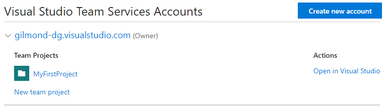
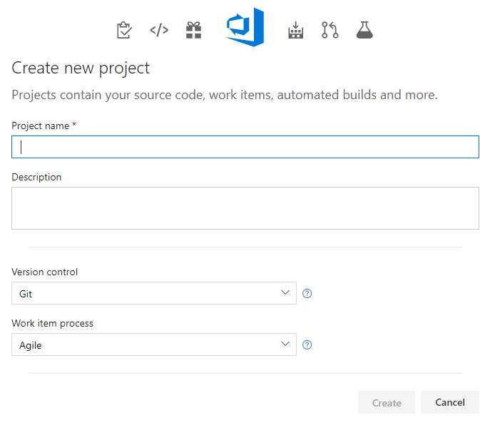
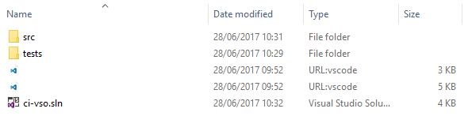
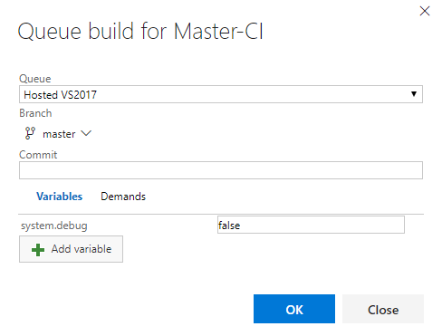
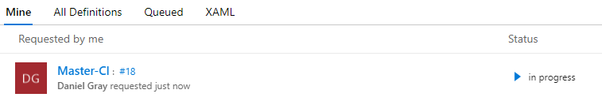
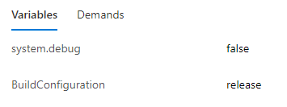
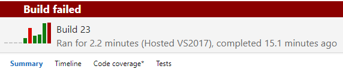
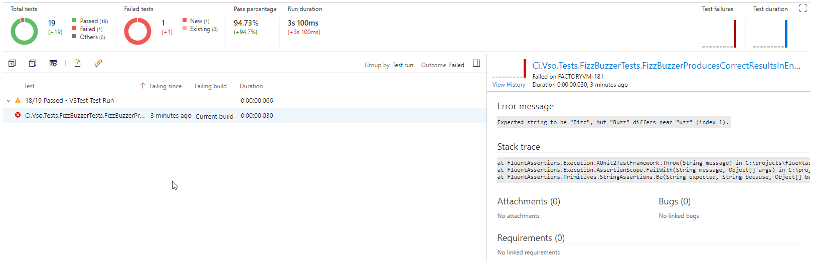
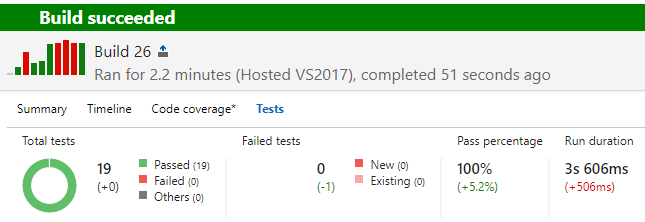

# Continuous Integration with Visual Studio Online 

### Prerequisites

You'll need the following to be able to complete this code lab:

* A [Visual Studio Online account](https://www.visualstudio.com/)

## Create New VSO Project

From your Visual Studio Online account homepage ([VSO Account Homepage](https://app.vsaex.visualstudio.com)) click the 'New team project' link and provide a name and description (doesn't matter what).

Make sure that you select 'Git' under 'Version control'

## Pull example solution from Github

Download the code-labs source from Github as a ZIP from the following URL:

[https://github.com/Gilmond/code-labs/archive/master.zip](https://github.com/Gilmond/code-labs/archive/master.zip)

From inside the ZIP file pull out the folder called 'ci-vso'. This is the sample code we'll use in our build and testing scenarios.

## Push example solution into VSO

From your newly created VSO team project clone the git repository and copy in the _contents_ of the 'ci-vso' folder from the ZIP file.

You should then have the following in the root of your local repository:

Stage the changes and push them to your remote VSO repository. You should now be able to see the example solution in your VSO repository via the web interface.

### Example solution structure

The example solution is very basic and covers a few simple scenarios for our CI process. It has:

* a common library (src\ci-vso-lib)
* a console app (src\ci-vso)
* a web app (src\ci-vso-web)
* a test library (tests\ci-vso-tests)

What does it do? Not much - but just enough to prove the point - a FizzBuzz implementation.

## Setting up a CI build definition

We're going to build up our build definition piece by piece - running the build at each step to verify what it's doing / how.

The aim of this definition is to compile all the example code and run all the tests within it. We're trying to achieve this as quickly as possible to reduce our round-trip times.

From the top nav bar click on 'Build & Release'

You should get a screen telling you there are no definitions. So click 'New definition' and get started:

* Use an empty template - this way you'll know exactly what steps you've added
* Notice a step has already been added called 'Get sources' - this will pull the source from the Git repository
* Set the name of the build to Master-CI
* Select the 'Options' tab and on the right hand side open the drop down 'Default agent queue' and select 'Hosted VS2017'
* Select the 'Tasks' tab
* Add a '.NET Core' step
    * Change the command to `restore`
    * Enter `**\*.csproj` in the Projects field
* Hit 'Save & queue' - you'll be presented a popup where you can customise build variables and the branch. Leave everything as it is:

Your build will be queued up:

Hopefully - in about 30 seconds (depending on queueing time) - you'll get a successful build. Click through to instance of the build and you'll be able to inspect the steps that were executed and their outputs.

All we've done so far is restore our NuGet packages - we still need to:

* Build
* Run tests
* Publish test results
* Package up the build output

### Building the source

Edit your build definition and do the following:

* Select the 'Variables' tab
* Click '+ Add'
    * For name, enter : `BuildConfiguration`
    * For value, enter : `release`
    * Make sure the 'Settable at queue time' checkbox is ticked - this allows us to change the build configuration when we queue a build - so we can produce debug builds
* Return to the 'Tasks' tab
* Click 'Add Task'
* Select the .NET Core task and click 'Add'
* You'll note the new task has been defaulted to the command 'build'
* Set the projects field to `**\*.csproj`
* Set the arguments field to `--configuration $(BuildConfiguration)`
    * The `$(BuildConfiguration)` part will be expanded by the build process with the value in the variable we just defined.
* Hit 'Save & queue', notice in the popup there's no an entry for the variable we defined:

### Running tests and publishing results

Your build _should_ still be successful. Not for long though... now we're going to enable running of our tests and publishing the results into VSO, so re-edit your definition:

* Select the 'Tasks' tab
* Click 'Add Task'
* Select the .NET Core task and click 'Add'
* Change the command to `test`
* Set the projects field to `tests\**\*.csproj`
* Set the arguments field to `--configuration $(BuildConfiguration) --logger:trx`
* Click 'Add Task'
* Select the Publish Test Results task and click 'Add'
* Hit 'Save & queue'
* In the Test result format dropdown select `VSTest`
* Set the Test results files field to `**\*.trx`
* Expand the Control Options section 
* In the Run this task dropdown, select `Even if a previous task has failed, unless the build was cancelled`
* Hit 'Save & queue'

Bad times - your build is now broken - thanks to the _cough_ deliberate bug. Look at the details of the broken build and click the 'Tests' subheading:

From here you _should_ be able to deduce the problem - but hold your horses, don't fix it yet - we're going to add a trigger to the build first.

### Setting up integration triggers

Edit your build definition again:

* Select the 'Triggers' tab 
* On the left hand side flick the Continuous Integration switch to 'Enabled'
* Leave all the other values as their defaults
* Hit 'Save'

### Fix test break

Now when you push a change to fix your broken test you'll immediately get a build queued for that change.

So long as you've found the _cough_ deliberate mistake you should see a verdant field of integration glory:

### Enable publishing of build output

Edit your build definition again:

* Select the 'Tasks' tab
* Click 'Add Task'
* Select the .NET Core task and click 'Add'
* Change the command to `publish`
* Set the arguments field to `--configuration $(BuildConfiguration) --output $(build.artifactstagingdirectory)`
* Click 'Add Task' again
* Select the .NET Core task and click 'Add'
* Change the command to `publish`
* Set the arguments field to `--configuration $(BuildConfiguration) --output $(build.artifactstagingdirectory)`
* Uncheck the 'Publish Web Projects' checkbox
* Set the Projects field to `src\ci-vso\*.csproj`
* Select the Publish Artifact task and click 'Add'
* Set the Path to Publish field as `$(build.artifactstagingdirectory)`
* Set the Artifact Name to `drop`
* Set the Artifact Type field to `Server`
* Hit 'Save & Queue'

Once this build completes you'll have a new top level tab in your build report 'Artifacts'. You can either download a `drop.zip` file that will contain your build output or view it's contents in the webapp - either way you should see it contains two zip files : `ci-vso-web.zip` and `ci-vso.zip` which are the output of our two 'end-point' projects.

### Code Coverage

Alas this isn't currently supported for .NET Core - it's coming, just not yet. 

# _**Don't read this if you don't want to know what the test break was**_

One of the test cases in FizzBuzzerTests.cs is wrong - it states the expected result is `Bizz` when it should be `Buzz` - it's on line 25 - `[InlineData(5, "Bizz")]`