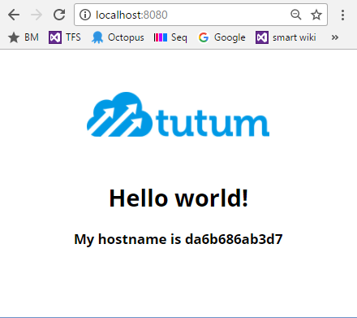
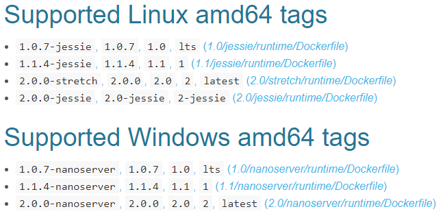
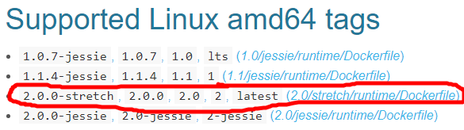
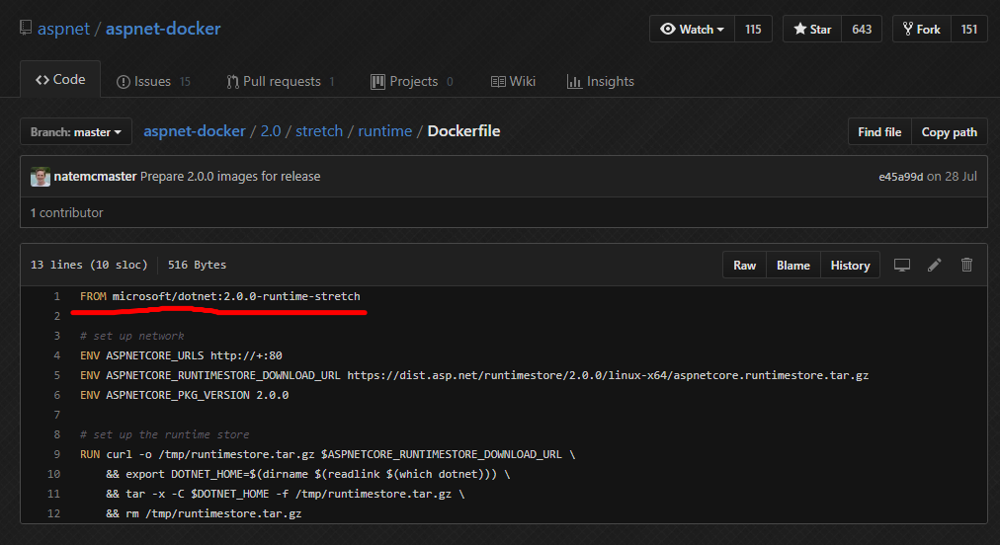
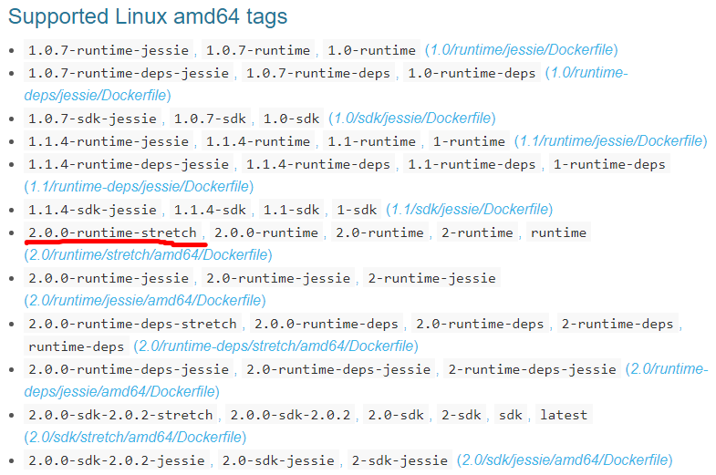
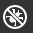

# Docker


This lab demonstrates the fundamentals concepts of docker.

## Overview

This lab will get you familiar with the Docker command line.
In this lab, you will create a new container from an existing image downloaded from the docker registry. You will learn to start, stop and remove containers. You will also create and run your own image which will be pushed to your own registry.

Got Docker for Windows? If you have not yet installed Docker for Windows, please see [Install Docker for Windows](https://docs.docker.com/docker-for-windows/install/).

### Notes

* This lab will use the [new management commands](https://blog.couchbase.com/docker-1-13-management-commands). Docker 1.2 CLI had about 40 top-level solo commands. Docker 1.13 and onwards now group the commands logically into management commands. Now a list of images is obtained using `docker image ls` command instead of `docker images` command. Similar `docker container ls` shows the list of containers instead of `docker ps`. Currently both the old and new commands both work, however the old commands maybe removed.

* We will be running docker on Linux Containers. Make sure you `Switch to Linux containers...` if you are not already doing so. To check this, right click on the Docker **whale** in the `System Tray`. If it says `Switch to Windows containers...` then leave it alone, otherwise select `Switch to Linux containers...`.

 

## Docker Overview

Docker is a tool to run applications in an isolated environment. It gives you advantages similar to running your application in a virtual machine. Some of those advantages are:

* Your app always runs in exactly the **same environment**, so you don't get inconsistences in how it behaves. If it runs on your computer it works on every computer (Linux, macOS, and Windows).
* If you work on multiple projects it lets you **sandbox** each one and keeps them separate. Good for security and eliminates potential conflicts between different projects.
* Makes it easier to get going with other people's projects. You don’t have to install all the tools and dependencies that the project needs. Just spin up the virtual machine, put you code inside and **it just works**.

Docker gives you these advantages but without the overhead and hassle of managing a virtual machine. Instead we have containers. The code and the environment are all wrapped up in a container.

### Containers


Containers operate at the process level, which makes them very lightweight and perfect as a unit of software delivery. While VMs take minutes to boot, containers can often be started in less than a second. Containers use fewer resources, take up less disk space and use less memory.

### Images

A container is a running instance of an image. An image has the operating system, the software and the application code all bundled up in a file.


Docker gives you the ability to snapshot the OS into a shared image, and makes it easy to deploy on other Docker hosts. You start with a base image, and then make your changes, and commit those changes using docker, and it creates an image. This image contains only the differences from the base. When you want to run your image, you also need the base, and it **layers** your image on top of the base using a layered file system.  You can keep adding more and more images (layers) and it will continue to only save the diffs. Since Docker typically builds on top of ready-made images from the [registry](https://hub.docker.com/), you rarely have to **snapshot** the whole OS yourself.

### Docker Registry

The Registry is a stateless, highly scalable server side application that stores and lets you distribute Docker images.

## Running Existing Image

### Check installation

Start Command Prompt (cmd.exe) and verify the installation of docker by running the command:

```cmd
docker --version
```

### Explore and run examples

First we will run an existing [hello-world](https://hub.docker.com/r/tutum/hello-world) web app docker image that is available from the [docker hub registry](https://hub.docker.com/). This image has Apache, with a 'Hello World' page listening on port 80. Its layered on top of an [alpine](https://hub.docker.com/_/alpine/) image.

`docker container run` will pull an image, create a new container from it and then start that container.

```cmd
docker container run tutum/hello-world
```

The command output shows all the different layers that exist for this image and also where the image was found, locally or not. If it's not found in your local *repository*, then its pulled from the docker *registry*.

By default, the `docker container run` command attached the command prompt to the container's interactive shell, so you need to use `Ctrl + C` to return control to the command prompt. If you add the `-d` option to the command, the command prompt will remain disconnected and the container will run in the background.

To see a list of containers that are running, run command:

```cmd
docker container ls
```

This shows you the container ID, name of the image, port and container name. If the name is not supplied then an automated name is created. Names are supplied with `--name <name>` parameter. You can see the docker container is exposing port 80.

If you go to port 80 on local host, e.g. [localhost:80](http://localhost:80) it doesn't work.

The reason it doesn't work is that we need to bind the exposed port of 80 from the container to a port on the host (your machine). Here we are mapping our host's port 8080 to the container's port 80:

```cmd
docker container run -d -p 8080:80 tutum/hello-world
```

Now go to [localhost:8080](http://localhost:8080) to see the following page:



The hostname displayed in the page is the container ID.

Run command `docker container ls`. We now have 2 containers running. Let's stop and remove the first container as the ports are not mapped and is useless to us. To stop the first container, run command:

```cmd
docker container stop [container id or name]
```

To see both running and stopped containers run command:

```cmd
docker container ls -a
```

To remove the stopped container run command:

```cmd
docker container rm [container id or name]
```

Now let's run 2 more containers, with supplied names this time, that binds the port of the container to ports 8081 and 8082:

```cmd
docker container run -d --name web2 -p 8081:80 tutum/hello-world
docker container run -d --name web3 -p 8082:80 tutum/hello-world
```

We should now have 3 web apps running on:
* [localhost:8080](http://localhost:8080)
* [localhost:8081](http://localhost:8081)
* [localhost:8082](http://localhost:8082)

### Create Image

We're now going to *dockerize* an ASP.NET Core application. To do this, we'll first need to decide which image should be used to run our application.

#### Find Image

We want to find an `aspnetcore` image, that runs on Linux, that we can build on top of.

Search for `microsoft/aspnetcore` in the [docker hub](https://hub.docker.com/r/microsoft/aspnetcore). Whenever possible, use current Official Repositories as the basis for your image.

>_**Note**: When you search for `aspnetcore` on docker hub, you'll find many results. Most of these are slight modifications of the original image tailored by individuals. In this case, we want the `microsoft/aspnetcore` image which is clearly the official author._



As you can see, there's quite a lot going on in the above screenshot. The first thing to note is that support for Linux and Windows images does not denote which Operating System (OS) the images can be used on. If you're using *Docker for Windows*, as shown earlier, you can right click the Docker icon in the task tray and switch between Windows and Linux images. The mode your docker is running in determines which of the above images docker will use. Because we switched to Linux mode earlier, we'll be using Linux images.

There are also multiple *tags* for several of the docker images. The docker images at the top (of both Windows and Linux supported categories) are tagged with `'1.0.7'`, `'1.0'`, and `'lts'` (which stands for 'long-term stability'). It is important to note that **tags are not permanent**. Microsoft may decide to promote `1.1.4` or `2.0.0` versions of the images, which would move the `lts` tag to the new image. This is considered a best practice for docker images, and allows consumers to determine for themselves which release branch(es) they want to build on top of.

For a production release, you'd likely want to rely upon the most granular tag (`'1.0.7'`) because that tag should never move, which guarantees stability for your deployments. If you trust the repository owner to maintain [semver](http://semver.org/) with their tags, you might also choose to use the `'1.0'` tag which should allow you to receive reverse compatible, non-breaking updates if they are published (when the tag is moved to `1.0.8` for example).

These conventions are common across a majority of docker repositories, and are important to understand so that your application depends on the correct branch. As with any dependency on any third party software, it is your responsibility to keep an eye on your dependencies for critical security flaws, and update your software accordingly.

We want to use the current `latest` tag (which should be the latest stable release), but we'll refer to the `2.0.0` tag for stability. In the above example, we can see there are actually two images using the `1.1.2` prefix. This usually indicates a difference in base image; remember we are running Linux containers so we want to find the Linux image (not Windows).

Let's click on the Linux 2.0.0 *Stretch* [(DockerFile) link](https://github.com/aspnet/aspnet-docker/blob/master/2.0/stretch/runtime/Dockerfile) to see how the image was made.




At the top of the Dockerfile you have the `FROM` directive which sets the base image. The `aspnetcore` image is built on top of the `microsoft/dotnet:2.0.0-runtime-stretch` image. 

Search for `microsoft/dotnet` in the [docker hub](https://hub.docker.com/r/microsoft/dotnet/) and find the corresponding `2.0.0-runtime-stretch` tag in the list.



Again, clicking the associated [(Dockerfile) Link](https://github.com/dotnet/dotnet-docker/blob/master/2.0/runtime/stretch/amd64/Dockerfile) and checking the `FROM` directive, you'll see the next image in the chain is `microsoft/dotnet:2.0-runtime-deps`, and following that Dockerfile you'll see the `FROM` directive is `debian:stretch` (which in turn comes from `scratch`).

As you can see, images often represent a stack of other images.

>_**Note**: Windows images are typically identified with tags relating to the base `nanoserver`. Docker images primarily use linux, so if nothing is specified, linux is likely the base image used._

### Docker File

Now that we know which image we're going to build on top of, we'll use a `Dockerfile` to build our image. Images are defined using a Dockerfile which is a text file with a list of steps to perform to create that image.
For example, you would configure the operating system, install the software you need, copy the project files into the right places, etc.

 

> _**Note**: This next section uses the output of the [MVC lab](https://github.com/Gilmond/code-labs/blob/master/docs/asp-net-mvc.md). If you have started but haven't completed the lab, just make sure your code can compile and there is at least one API endpoint available (i.e. you can navigate to one of your Controller methods). If that's going to take more than a couple minutes or if you don't have a copy of the MVC lab, use `dotnet new web` which will give you a "Hello World" application to use._

In your MVC lab folder, navigate to `src\TodoApplication` and create a file called `Dockerfile` (no file extension).

What we're aiming for is two-fold. The first step is to build our application, the second is to host it. Ideally, we don't want to put all the heavy dependencies required to build .Net Core applications into our final output image, which fortunately Docker fully supports.

We'll start by specifying a build environment for our application using the `FROM` directive to set the Base Image for subsequent instructions.

```docker
FROM microsoft/aspnetcore-build:2.0 AS build-environment
```

The `WORKDIR` directive sets the working directory. If this `WORKDIR` doesn’t exist, it will be created.

```docker
WORKDIR /app
```

The `COPY` directive specifies the files we want to copy from our host machine, into the image. First we'll copy over the `csproj`:

```docker
COPY *.csproj ./
```

Then we'll have the image perform a `dotnet restore`:

```docker
RUN dotnet restore
```

With the project dependencies in place, copy over everything else and run `dotnet publish`:

```docker
COPY . ./
RUN dotnet publish -c Release -o out
```

> _**Note**: The `. ./` notation shown denotes that everything from the same directory as this `Dockerfile` on the host machine should be copied into the target directory inside the image (which is `/app` because `WORKDIR` was set)._

With the application built and published, we now want to create the second image using the output of the first.

First, set the base image to the `stretch` tag we found earlier:

```docker
FROM microsoft/aspnetcore:2.0-stretch
```

Again, we'll set a working directory:

```docker
WORKDIR /app
```

This time, we'll copy the output from the first image into our working directory:

```docker
COPY --from=build-environment /app/out
```

An `ENTRYPOINT` allows you to configure a container to run an executable when it starts. We want to run the `dotnet TodoApplication.dll` command in the container.

```docker
ENTRYPOINT ["dotnet", "TodoApplication.dll"]
```

Your Dockerfile should now look like this:

```docker
FROM microsoft/aspnetcore-build:2.0 AS build-env
WORKDIR /app
COPY *.csproj ./
RUN dotnet restore
COPY . ./
RUN dotnet publish -c Release -o out

FROM microsoft/aspnetcore:2.0
WORKDIR /app
COPY --from=build-env /app/out .
ENTRYPOINT ["dotnet", "TodoApplication.dll"]
```

### Docker Build

Run the following command to build and name your image:

```cmd
docker image build -t <name> <location of DockerFile>`
```
The first time you do this it will download all the layers that make up that `aspnetcore-build` and `aspnetcore` images. It will then carry out each step within the Dockerfile, e.g. Copy files.

You can now `run` this image. Don't forget to use the `-p` parameter to bind the ports.

Go to your localhost on the correct port to see the TodoApplication working.

#### Interactive Mode

Earlier we explained that you can use the `-d` option to run a container without attaching the command prompt. You can also explore running containers by running commands like

```cmd
docker container exec -it <name> /bin/sh
```

This will attach the command prompt to an interactive shell inside the container, allowing you to explore the OS and execute commands within the container. To **exit**, type the command `exit`.

### Custom Registry

When you built your image in the previous section, the image was added to your local *repository*. This repository is available out of the box with docker. A *registry* can contain many repositories, as seen when working with Docker Hub. To work with custom registries, we can actually just run a registry within a docker container.

To start your own registry (on localhost:5000), run the following command with an image name of your choosing:

```cmd
docker container run -d -p 5000:5000 --name <registry_name> registry:2
```

If you list your running containers your registry should now appear.

We saw in previous sections that tags can be used to identify release branches, versions, base images, etc. They are also paramount to interacting with custom registries.

We can add a tag to an image specifying a private registry's hostname and port using commands like the following, which in this case tags the `tutum/hello-world` image to our registry, located on `localhost:5000`, and gives it the name `myfirstimage`.

```cmd
docker image tag tutum/hello-world localhost:5000/myfirstimage
```

Notice that we didn't specify a version for our `myfirstimage`, so docker will assume the image's tag to be `latest`. We can override this default behaviour by specifying a version. For example, use the following command to tag our `myfirstimage` as version `1.0`:

```cmd
docker image tag tutum/hello-world localhost:5000/myfirstimage:1.0
```

Running the command `docker image ls` will list your new images in your local repository:


> _**Note**: If you have a large number of images, you can `prune` them to get rid of any you aren't using which should help reduce noise:_
>
>```cmd
>docker system prune -a
>```

At this stage, they still only exist in our local *repository*. To push them to our *registry*, we can use the following command:

```cmd
docker image push localhost:5000/myfirstimage:1.0
```

Now that we've pushed our image to the *registry*, we can clear down our local *repository*:

```cmd
docker image rm localhost:5000/myfirstimage
docker image rm localhost:5000/myfirstimage:1.0
```

Running the command `docker image ls` to list your images again should show that your unused images are now gone. We can pull our image back down from the registry using:

```cmd
docker pull localhost:5000/myfirstimage:1.0
```

To see the content of your registry go to [http://localhost:5000/v2/myfirstimage/tags/list](http://localhost:5000/v2/myfirstimage/tags/list)

To stop your registry and remove all data run the command:

```cmd
docker stop <registry_name> && docker rm -v <registry_name>
```

## How to Automate Tasks in VS Code

VS Code can integrate with external tools via Tasks. You should see a `tasks.json` file in the `.vscode` folder. Let's edit this so that every time you build your application it will also run your app within a docker container.

Change the existing `tasks.json` file to the following.

```json
{
    "version": "0.1.0",
    "command": "dotnet",
    "isShellCommand": true,
    "args": [],
    "tasks": [
        {
            "taskName": "build",
            "command": "powershell",
            "args": [
                "dotnet restore src/TodoApplication /ConsoleLoggerParameters:Verbosity=quiet",
                ";dotnet publish -v m src/TodoApplication",
                ";docker image build -t todoapplication src/TodoApplication",
                ";docker container rm -f todoapp",
                ";docker container run -d --name todoapp -p 8090:80 todoapplication"
            ],
            "isBuildCommand": true,
            "problemMatcher": "$msCompile"
        }
    ]
}
```

Build your application using `Ctrl+Shift+B`, the output of your task can be seen in the OUTPUT tab.

Go to [localhost:8090](http://localhost:8090) to see you MVC lab running within docker.

### Remote Debugging Docker

We can configure VS Code to attached to our docker container during debug. To do this:

* Edit Dockerfile to add VS debug commands to the base image.
* Edit launch.json to configure VS Code to attach to docker and to use those debug commands.

#### Dockerfile Change

Edit your Dockerfile and add the following after the `FROM` line:

```docker
WORKDIR /vsdbg
RUN apt-get update \
&& apt-get install -y --no-install-recommends \
unzip \
&& rm -rf /var/lib/apt/lists/* \
&& curl -sSL https://aka.ms/getvsdbgsh | bash /dev/stdin -v latest -l /vsdbg
```

Your Dockerfile should look like this:

```docker
FROM microsoft/aspnetcore:1.1.2
WORKDIR /vsdbg
RUN apt-get update \
&& apt-get install -y --no-install-recommends \
unzip \
&& rm -rf /var/lib/apt/lists/* \
&& curl -sSL https://aka.ms/getvsdbgsh | bash /dev/stdin -v latest -l /vsdbg
WORKDIR /app
COPY bin/Debug/netcoreapp1.1/publish/ .
ENTRYPOINT ["dotnet", "TodoApplication.dll"]
EXPOSE 80
```

#### Launch.json

You should see a `launch.json` file in the `.vscode` folder. Append the following configuration to it:

```json
{
    "name": "Docker Attach",
    "type": "coreclr",
    "request": "attach",
    "sourceFileMap": {
        "/app": "${workspaceRoot}/src/TodoApplication"
    },
    "processName": "dotnet",
    "pipeTransport": {
        "debuggerPath": "/vsdbg/vsdbg",
        "pipeProgram": "docker",
        "pipeCwd": "${workspaceRoot}",
        "pipeArgs": [
            "exec", "-i", "todoapp"
        ],
        "quoteArgs": false
    }
}
```

#### Debug Docker Container

Now navigate to Debug on the left hand toolbar of VS Code



and select `Docker Attach` from the `Debug` dropdown menu.


You can now debug within the docker container!

## Next Steps

We recommend you continue to play with Docker whenever you get the opportunity. In our next lab we'll use the output from this code lab to work with `docker-compose`, and introduce concepts from `docker swarm`.
