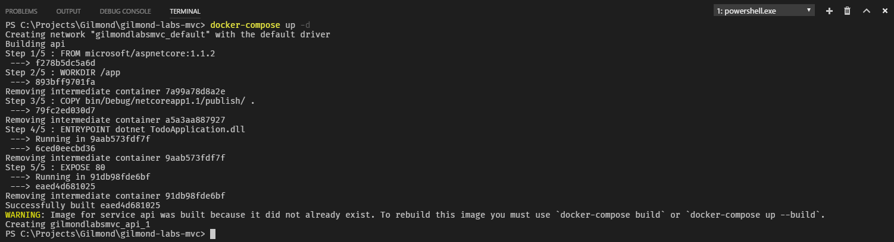
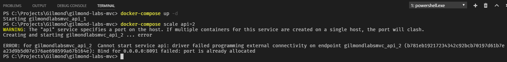
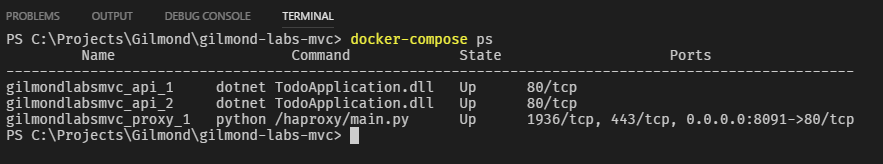
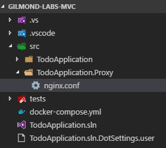
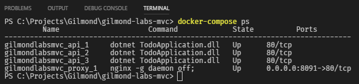
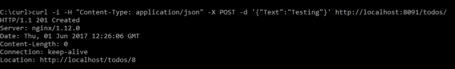
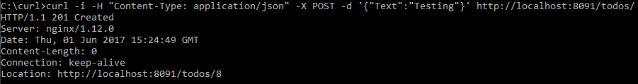

# Docker Compose


This lab demonstrates usage of [*Docker Compose*](https://docs.docker.com/compose/).

## Overview

In this lab we'll extend upon the [ASP.Net MVC](./asp-net-mvc.md) and [Docker](./docker-basics.md) labs completed previously. We'll introduce [scaling](https://en.wikipedia.org/wiki/Scalability) through *Docker Compose* and tackle the problems that arise as a result of this.

> You **must** have completed the [previous two labs](https://github.com/gilmond/code-labs) to complete this lab.

### Notes

* *IDE*: As with the *ASP.Net MVC* and *Docker* labs, whilst this lab *can* be completed with Visual Studio (or any IDE of your preference), we recommend and have written this guide for *VS Code*.

## Introduction

*Compose* is a tool for defining and running multi-container applications. *Compose* uses a project name to isolate environments from one another, allowing for multiple isolated environments on a single host. Any declared *volumes* are preserved and transferred from previous containers to new containers to ensure any data isn't lost. *Compose* also tracks changes to your container configurations so that deployments can re-use existing containers that do not need to be re-deployed.

These features and the simplicity of it's tooling makes this an invaluable tool for development, testing, and staging. However, services your applications depend on such as *MS SQL Server*, *Redis Cache*, *RabbitMQ*, etc. are unlikely to be deployed to production in the same manner. High availability, geo-redundant services are possible, but these dependent services will often be dedicated cloud resources or deployed to powerful servers outside of docker's remit.

*Compose* is completely compatible with [*Docker Swarm*](https://docs.docker.com/engine/swarm/), which itself and/or combined with *orchestration* tooling such as [Kubernetes](https://kubernetes.io/), [Docker Enterprise](https://www.docker.com/enterprise-edition), [Azure Container Service](https://azure.microsoft.com/en-us/blog/azure-container-service-preview/), etc. can securely link your *application* containers to these dependent services, making for a powerful and complete lifecycle.

## Part 1: Compose File

The first step in using *Compose* is to define a `Dockerfile`, which we completed in the previous lab:

```docker
FROM microsoft/aspnetcore:1.1.2
WORKDIR /app
COPY bin/Debug/netcoreapp1.1/publish/ .
ENTRYPOINT ["dotnet", "TodoApplication.dll"]
EXPOSE 80
```

> _**Note**: If you changed your `Dockerfile` to the remote debugging enabled image towards the end of the Docker lab, bear in mind that the remote debugging image is **much** larger than the normal ASP.Net Core image - it should only be used for remote debugging when necessary. Feel free to switch back to a basic `Dockerfile` as shown above._

The second step is to define a `docker-compose.yml` file at the root of your solution. The first section we add determines the [version](https://docs.docker.com/compose/compose-file/compose-versioning/) of *Compose* we want to work with. The latest stable recommended version is `3`:

```yml
version: '3'
```

> _**Note**: Unlike with your plain text `Dockerfile`, your `docker-compose.yml` file uses the [`yaml`](https://en.wikipedia.org/wiki/YAML) format, which is a human-readable serialization language commonly used in configuration files. If you have not worked with `yaml` before, it is important to note that **spaces matter**. That is, when you see indentiation in a `yaml` file, **use spaces, not tabs**._

Now we'll declare the services we want to use. For the time being, the only service we care about is the API we created previously. There are [several elements](https://docs.docker.com/compose/compose-file/#service-configuration-reference) we can configure for our services, but for now we'll concentrate on these points:

* Name - the name docker will use to refer to your service
* Build - the relative path to the directory containing your `Dockerfile` for the service
* Ports - the ports you want to bind

```yml
api:
  build: ./src/TodoApplication
  ports: 
    - 8091:80
```

As is hopefully evident, the above configuration defines our service with the *name* "api", points to the `Dockerfile` relative from your `docker-compose.yml`, and binds port 6000 on your host to port 80 on the container (which was the port defined in your `Dockerfile` under `EXPOSE`).

> _**Note**: Indentation shown uses two normal spaces. Be careful, especially when using 4 spaces, that your IDE doesn't replace the spaces with tabs._

The complete `docker-compose.yml` file should look as follows:

```yml
version: '3'
services:
  api:
    build: ./src/TodoApplication
    ports: 
      - 6000:80
```

## Part 2: Compose Commands

The third step is to deploy our service:

* Press `Ctrl + Shift + '` *(`Terminal: Create new integrated Terminal`)* to bring up the terminal.
  * Ensure the terminal has opened the in the solution (root) directory. If it hasn't, navigate to it using `cd`.
* In the terminal, use the command `docker-compose up -d` to push your service into compose.
  * Adding the `-d` option to the command works in much the same way it did when you used `docker container run` in the *docker basics* lab; the command prompt will remain disconnected and the container will run in the background.



You can now access your API on the port specified in your `docker-compose.yml` file (port `8091` if following along).

You can also see the log output of your application using the command `docker-compose logs`.

Finally, you can stop your container(s) using the command `docker-compose down`.

## Part 3: Scaling

So far, we've essentially replicated the behaviour of using *docker* in the basic lab, so why bother with the extra work to get *docker compose* running? There are several benefits, one of which is the ability to instantly scale your applications.

In the terminal, start your service using `docker-compose up -d`, and then use the command `docker-compose scale api=2` to scale your API up to 2 instances.



Notice that we are unable to start a second API because both would be attempting to bind to the same port. To fix this we'll need to introduce a [proxy](https://en.wikipedia.org/wiki/Proxy_server).

### Proxy

In order to scale your web services, you need a single *entrypoint* for clients to access, which routes your requests to the web services. There are many ways to do this, demonstrated here are two types of proxy you can use. Whilst a preliminary introduction to `HAProxy` is provided next, the remainder of this lab will assume you've used `NGINX`.

#### HAProxy

[HAProxy](https://en.wikipedia.org/wiki/HAProxy) is a free, open-source proxy server. The difference between this and other proxy servers is largely subjective and circumstantial, so unless a requirement drives you to one proxy or another, I recommend you be aware of at least a few and decide for yourself which you prefer to work with.

To get our API to work with *HAProxy*:

1. Add a new service to `docker-compose.yml` named `proxy`
1. Use the `image` directive, instructing docker compose that this service is an existing image (doesn't need building like with your API), called `tutum/haproxy`
1. Use the `links` directive to link the proxy to your API.
1. Move the `ports` binding from your API to the proxy's configuration.

```yml
version: '3'
services:
  api:
    build: ./src/TodoApplication
  proxy:
    image: tutum/haproxy
    links:
      - api
    ports: 
      - 8091:80
```

You can now run `docker-compose up -d` to start 2 instances of your API (because you ran `scale api=2` previously), fronted by your HAProxy. Type `docker-compose ps` in the terminal to see all your services running.



As before, you can again access your API, but this time either one of the API instances may service your request.

> _**Note**: Whilst this was simple to setup and required almost zero configuration, bear in mind that the `tutum/haproxy` image is doing a lot of work for you in the background, which may not be suited to all use cases, not to mention difficult to extend or adapt._

#### NGINX

[NGINX](https://nginx.org/en/) (pronounced "Engine X") is also a free, open-source proxy server, though several more advanced features are only available under their commercial [NGINX Plus](https://www.nginx.com/products/) offering. We're unaware of a docker image that can automatically manage docker links in the same way the `tutum/HAProxy` image does, so there's a little bit more configuration required to get up and running.

First, add a new `TodoApplication.Proxy` directory under `./src/` so that you have somewhere to hold the files you'll need. In your new `*.Proxy` directory, add a new file named `nginx.conf`.



This configuration can grow to be quote [long-winded](https://www.nginx.com/resources/wiki/start/topics/examples/full/) in complex scenarios, but we don't need anything anywhere near as complicated.

```nginx
http {
  resolver 127.0.0.11;

  server {
    listen 80;
    location / {
      proxy_pass	"http://api";
      proxy_redirect	off;
      proxy_set_header	Host $http_host;
      proxy_set_header	X-Forwarded_Proto $scheme;
    }
  }
}
```

There are several moving parts here so I'll step through the important directives of the config:

* [`resolver`](http://nginx.org/en/docs/http/ngx_http_core_module.html#resolver) is used to configure the name servers used by your proxy. 
  * In this case we're setting it to `127.0.0.11` which is the *Docker* [Embedded DNS](https://docs.docker.com/engine/userguide/networking/#embedded-dns-server), which allows us to resolve our service names (i.e. "api" will resolve to the IP addresses of all your API containers).
* [`listen`](http://nginx.org/en/docs/http/ngx_http_core_module.html#listen) specfies the address and/or port you want NGINX to listen on. Here, we're accepting requests on port `80`.
* [`location`](http://nginx.org/en/docs/http/ngx_http_core_module.html#location) sets configuration based on incoming URIs, where `/` will match *all* requests.
* [`proxy_pass`](http://nginx.org/en/docs/http/ngx_http_proxy_module.html#proxy_pass) is used to set the protocol and address of a server. If the address is specified as a domain name (instead of IP) that resolves to multiple addresses, all of them will be used in a *round-robin* fashion.
* [`proxy_set_header`](http://nginx.org/en/docs/http/ngx_http_proxy_module.html#proxy_set_header) is used to add additional headers to the request before passing it to our upstream server(s).
  * Well known HTTP header information can be [found here](https://en.wikipedia.org/wiki/List_of_HTTP_header_fields).
  * These headers will be used by MVC Middleware to override the *host* configuration for your application, so that it behaves as if it's receiving the request the proxy receives, instead of the forwarded request. This ensures that any URIs your application outputs are to the proxy's address and not the internal address of the upstream server.

Next, add a new `Dockerfile` to the `TodoApplication.Proxy` directory with the following contents:

```docker
FROM nginx:1.12.0
COPY nginx.conf /etc/nginx/smart.conf
```

As is probably evident, your `Dockerfile` will create an image based on the official `nginx` image, copying your `nginx.conf` file into the image.

Finally, update your `docker-compose.yml` file to use NGINX instead of the HAProxy you added previously:

```yml
version: '3'
services:
  api:
    build: ./src/TodoApplication
  proxy:
    build: ./src/TodoApplication.Proxy
    links:
      - api
    ports: 
      - 8091:80
```

The only change here should be switching from 

```yml
image: tutum/haproxy
```

to 

```yml
build: ./src/TodoApplication.Proxy
```

Once again you can confirm your services will deploy by running `docker-compose up -d` to update your services. `docker-compose ps` will confirm that you are now using NGINX instead of HAProxy:



### X-Forwarded-*

In the `TodoController` of your MVC application, you should have implemented both a `Create` and `Update` endpoint. If following the API best practice guidance during the MVC Code Lab, the responses for these Create/Update calls should include a `Location` header specifying the location of the created/updated resource.

Depending on your implementation, these URIs will either be relative or absolute. We recommend that the URIs be absolute so that a UI has less work to do, but if you test one of these endpoints you'll see that absolute `Location` URIs refer to an *internal* address, not something that you can access from your browser.



It may not be immediately obvious in the above screenshot, but note that I sent the request to `localhost:8091` whilst the `location` header specifies `localhost` (without the port). This is because your ASP.Net application believes it is running on port 80, as defined in your application's `Dockerfile` (port 80 is implicit and removed from the URL).

To rememedy this, Microsoft provide some middleware that can utilise the `X-Forwarded-*` headers that you configured NGINX to provide.

1. Press `Ctrl + Shift + '` *(`Terminal: Create new integrated Terminal`)* to bring up the terminal.
1. Navigate the terminal to the `./src/TodoApplication` directory using `cd`.
1. In the terminal, type `dotnet add package Microsoft.AspNetCore.HttpOverrides`
1. In the `Startup.cs` class, add the following early in your middleware pipeline:

```csharp
app.UseForwardedHeaders(new ForwardedHeadersOptions
{
    ForwardedHeaders = ForwardedHeaders = ForwardedHeaders.All
});
```

5. Import the `Microsoft.AspNetCore.HttpOverrides` namespace.
  * Don't forget to **Save the file**.
6. In the terminal, type `dotnet publish` to rebuild and re-publish your application.
7. Navigate the terminal back to the root of your solution using `cd ../..`.
8. In the terminal, type `docker-compose build` to rebuild the docker image.
9. In the terminal, type `docker-compose up -d` to deploy your updated services.

Now when we create a *Todo*, the `Location` header in the response should be set correctly.



> _**Troubleshooting**: If you `Location` URI still doesn't show the port, the issue is that the connection's `RemoteIPAddress` and `RemotePort` have not been recognised as a loopback address. In a real word example you should resolve this by adding the Proxy IP to the `KnownProxies` list, but for sake of brevity you can simply remove the loopback addresses to [disable the check](https://github.com/aspnet/BasicMiddleware/blob/dev/src/Microsoft.AspNetCore.HttpOverrides/ForwardedHeadersMiddleware.cs#L142):
>
>```csharp
>var forwardedHeadersOptions = new ForwardedHeadersOptions 
>{ 
>  ForwardedHeaders = ForwardedHeaders.All
>};
>forwardedHeadersOptions.KnownNetworks.Clear();
>forwardedHeadersOptions.KnownProxies.Clear();
>app.UseForwardedHeaders(forwardedHeadersOptions);
>```
>
> Once you've changed this in your startup, follow the above steps to publish your application, build a new image, and re-deploy.

## State

Whilst it was relatively simple to scale your application with *Compose*, it has introduced an issue within our application.