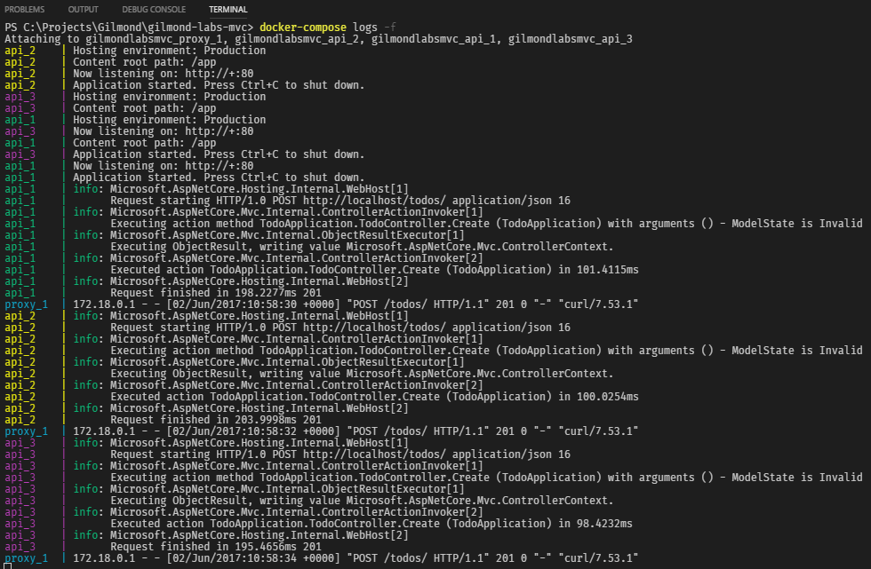

# Docker Compose


This lab demonstrates usage of [*Docker Compose*](https://docs.docker.com/compose/).

## Overview

In this lab you'll extend upon the [ASP.Net MVC](./asp-net-mvc.md) and [Docker](./docker-basics.md) labs completed previously. We'll introduce [scaling](https://en.wikipedia.org/wiki/Scalability) through *Docker Compose* and tackle the problems that arise as a result of this.

> You **must** have completed the [previous two labs](https://github.com/gilmond/code-labs) to complete this lab.

### Notes

* *IDE*: As with the *ASP.Net MVC* and *Docker* labs, whilst this lab *can* be completed with Visual Studio (or any IDE of your preference), we recommend and have written this guide for *VS Code*.
* This lab will require you to make requests to your API. Most developers have a favourite tool for doing so, whether you extend your application with [Swashbuckle](https://www.nuget.org/packages/Swashbuckle.AspNetCore), use [Fiddler](http://www.telerik.com/fiddler), prefer [Curl](https://curl.haxx.se/download.html), etc. please use what you feel comfortable with. Instructions will be given in *curl* commands which should easily translate to your preferred tooling. If you have none of this tooling, you can [download curl](https://akamai.bintray.com/f7/f7d3fd25979489614f8804f9df3b318b369b6b0e1a6860316b86e1386ad2ec8b?__gda__=exp=1496360148~hmac=51808d97a8b845d05aaaad1d4e30c7d329b5fcc110ce19d8959a3dcc330ec239&response-content-disposition=attachment%3Bfilename%3D%22curl-7.54.0-win64-mingw.7z%22&response-content-type=application%2Fx-www-form-urlencoded&requestInfo=U2FsdGVkX1-vjKXcOK_1tROEFI9ApDYpW_uXbOTm3WaI75oGjCmYji-8sjEemc2QtwHA9zeOFrjSVVp2X-aQ6ESey7rcvDWoxOEMNKo1sFy1qQBLKBxEriqMrLJND2y6jzV4367iUiZPBBVyGHxmdvAOEriLQWDKSivx6_GUfVtjz-XwEwrZrU97SNElJI1S) and extract the contents of the `bin` directory within the archive to somewhere easily accessible (or add the path to system `%PATH%`).

## Introduction

*Docker Compose* is a tool for defining and running multi-container applications. *Compose* uses a project name to isolate environments from one another, allowing for multiple isolated environments on a single host. Any declared *volumes* are preserved and transferred from previous containers to new containers to ensure any data isn't lost. *Compose* also tracks changes to your container configurations so that deployments can re-use existing containers that do not need to be re-deployed.

These features and the simplicity of it's tooling makes this an invaluable tool for development, testing, and staging. However, services your applications depend on such as *MS SQL Server*, *Redis Cache*, *RabbitMQ*, etc. are unlikely to be deployed to production in the same manner. High availability, geo-redundant services are possible, but these dependent services will often be dedicated cloud resources or deployed to powerful servers outside of docker's remit.

*Compose* is completely compatible with [*Docker Swarm*](https://docs.docker.com/engine/swarm/), which itself and/or combined with *orchestration* tooling such as [Kubernetes](https://kubernetes.io/), [Docker Enterprise](https://www.docker.com/enterprise-edition), [Azure Container Service](https://azure.microsoft.com/en-us/blog/azure-container-service-preview/), etc. can securely link your *application* containers to these dependent services, making for a powerful and complete lifecycle.

## Part 1: Compose File

The first step in using *Compose* is to define a `Dockerfile`, which we completed in the previous lab:

```docker
FROM microsoft/aspnetcore:1.1.2
WORKDIR /app
COPY bin/Debug/netcoreapp1.1/publish/ .
ENTRYPOINT ["dotnet", "TodoApplication.dll"]
EXPOSE 80
```

> _**Note**: If you changed your `Dockerfile` to the remote debugging enabled image towards the end of the Docker lab, bear in mind that the remote debugging image is **much** larger than the normal ASP.Net Core image - it should only be used for remote debugging when necessary. Feel free to switch back to a basic `Dockerfile` as shown above._

The second step is to define a `docker-compose.yml` file at the root of your solution. The first section we add determines the [version](https://docs.docker.com/compose/compose-file/compose-versioning/) of *Compose* we want to work with. The latest stable recommended version is `3`:

```yml
version: '3'
```

> _**Note**: Unlike with your plain text `Dockerfile`, your `docker-compose.yml` file uses the [`yaml`](https://en.wikipedia.org/wiki/YAML) format, which is a human-readable serialization language commonly used in configuration files. If you have not worked with `yaml` before, it is important to note that **spaces matter**. That is to say, when you see indentiation in a `yaml` file, **use spaces, not tabs**._

Now we'll declare the services we want to use. For the time being, the only service we care about is the API we created previously. There are [several elements](https://docs.docker.com/compose/compose-file/#service-configuration-reference) we can configure for our services, but for now we'll concentrate on these points:

* Name - the name docker will use to refer to your service
* Build - the relative path to the directory containing your `Dockerfile` for the service
* Ports - the ports you want to bind

```yml
api:
  build: ./src/TodoApplication
  ports:
    - 8091:80
```

As is hopefully evident, the above configuration defines our service with the *name* "api", points to the `Dockerfile` relative from your `docker-compose.yml`, and binds port 8091 on your host to port 80 on the container (which was the port defined in your `Dockerfile` under `EXPOSE`).

> _**Note**: Indentation shown uses two normal spaces. Be careful, especially when using 4 spaces, that your IDE doesn't replace the spaces with tabs._

The complete `docker-compose.yml` file should look as follows:

```yml
version: '3'
services:
  api:
    build: ./src/TodoApplication
    ports:
      - 8091:80
```

## Part 2: Compose Commands

The third step to using *Compose* is to deploy our service:

* Press `Ctrl + Shift + '` *(`Terminal: Create new integrated Terminal`)* to bring up the terminal.
  * Ensure the terminal has opened in the solution (root) directory. If it hasn't, navigate to it using `cd`.
* In the terminal, use the command `docker-compose up -d` to push your service into compose.
  * Adding the `-d` option to the command works in much the same way it did when you used `docker container run` in the *docker basics* lab; the command prompt will remain disconnected and the container will run in the background.


You can now access your API on the port specified in your `docker-compose.yml` file (port `8091` if following along). You can also see the log output of your application using the command `docker-compose logs`. Finally, you can stop your container(s) using the command `docker-compose down`.

## Part 3: Scaling

So far, you've essentially replicated the behaviour of using *docker* in the previous lab, so why bother with the extra work to get *docker compose* running? There are several benefits, one of which is the ability to instantly scale your applications.

In the terminal, start your service using `docker-compose up -d`, and then use the command `docker-compose scale api=2` to scale your API up to 2 instances.


Notice that you are unable to start a second API because both would be attempting to bind to the same port (`8091`). To fix this you'll need to introduce a [proxy](https://en.wikipedia.org/wiki/Proxy_server).

### Proxy

In order to scale your web services, you need a single *entrypoint* for clients to access, which routes your requests to the web services. There are many ways to do this, demonstrated here is `NGINX`, but we recommend that you become familiar with a couple of proxies.

#### NGINX

[NGINX](https://nginx.org/en/) (pronounced "Engine X") is also a free, open-source proxy server, though several more advanced features are only available under their commercial [NGINX Plus](https://www.nginx.com/products/) offering.

Add a new `TodoApplication.Proxy` directory under `./src/` so that you have somewhere to hold the files you'll need. In your new `*.Proxy` directory, add a new file named `nginx.conf`.


This configuration can grow to be quote [long-winded](https://www.nginx.com/resources/wiki/start/topics/examples/full/) in complex scenarios, but we don't need anything anywhere near as complicated.

```nginx
events {}
http {

  upstream api_backends {
    server api_1;
    server api_2;
    server api_3;
  }

  server {
    listen 80;
    resolver 127.0.0.11;

    location / {
      proxy_pass        http://api_backends;
      proxy_redirect    off;
      proxy_set_header  Host $host;
      proxy_set_header  X-Forwarded-For $proxy_add_x_forwarded_for;
      proxy_set_header  X-Forwarded-Host $http_host;
      proxy_set_header  X-Forwarded-Proto $scheme;
    }
  }
}
```

There are several moving parts here so I'll step through the important directives of the config:

* [`upstream`](https://nginx.org/en/docs/stream/ngx_stream_upstream_module.html#upstream) is used to configure a cluster of upstream servers, and can be used to determine the load balancing algorithm (*round-robin* by default).
* [`server`](https://nginx.org/en/docs/stream/ngx_stream_upstream_module.html#server) defines the address and configuration of a server within *NGINX*.
* [`resolver`](http://nginx.org/en/docs/http/ngx_http_core_module.html#resolver) is used to configure the name servers used by your proxy.
  * In this case we're setting it to `127.0.0.11` which is the *Docker* [Embedded DNS](https://docs.docker.com/engine/userguide/networking/#embedded-dns-server), which allows us to resolve our service names (i.e. "api" will resolve to the IP addresses of all your API containers).
* [`listen`](http://nginx.org/en/docs/http/ngx_http_core_module.html#listen) specfies the address and/or port you want NGINX to listen on. Here, we're accepting requests on port `80`.
* [`location`](http://nginx.org/en/docs/http/ngx_http_core_module.html#location) sets configuration based on incoming URIs, where `/` will match *all* requests.
* [`proxy_pass`](http://nginx.org/en/docs/http/ngx_http_proxy_module.html#proxy_pass) is used to set the protocol and address of a server. If the address is specified as a domain name (instead of IP) that resolves to multiple addresses, all of them will be used in a *round-robin* fashion.
* [`proxy_set_header`](http://nginx.org/en/docs/http/ngx_http_proxy_module.html#proxy_set_header) is used to add additional headers to the request before passing it to our upstream server(s).
  * Well known HTTP header information can be [found here](https://en.wikipedia.org/wiki/List_of_HTTP_header_fields).
  * These headers will be used by MVC Middleware to override the *host* configuration for your application, so that it behaves as if it's receiving the request the proxy receives, instead of the forwarded request. This ensures that any URIs your application outputs are to the proxy's address and not the internal address of the upstream server.

> _**Warning**: The configuration shown here is a quickstart for use in **development only**. Research and update your configuration in accordance with security best practices before using in an exposed or production environment._

Next, add a new `Dockerfile` to the `TodoApplication.Proxy` directory with the following contents:

```docker
FROM nginx:1.13.1
COPY nginx.conf /etc/nginx/nginx.conf
```

As is probably evident, your `Dockerfile` will create an image based on an official `nginx` image, copying your `nginx.conf` file into the image.

Finally, update your `docker-compose.yml` file to use NGINX.

```yml
version: '3'
services:
  api:
    build: ./src/TodoApplication
  proxy:
    build: ./src/TodoApplication.Proxy
    links:
      - api
    ports:
      - 8091:80
```

If you try and run this now using `docker-compose up -d`, it will appear as if everything has deployed correctly, but you will no longer be able to reach your API:


To diagnose this, examine the logs for the services using the command `docker-compose logs`.

> _**Note**: If there are a large amount of logs from previous runs, you can use the command `docker-compose up -d --force-recreate` to redeploy the services, and then use `docker-compose logs` again to see a minimal log set._


Notice the warnings from `proxy_1` explaining that it is unable to find an upstream server. That's because we declared three upstream servers in `nginx.conf`, but so far have only scaled our API to 2 in *Docker Compose*.

In order to remedy this, you will need to ensure *Compose* scales your API to match the number of entries in the `nginx.conf` `upstream` section. In the example above, 3 were declared (`api_1`, `api_2` and `api_3`), so use the command `docker-compose up --scale api=3` which will start three containers for your API (shown here using `docker-compose ps`).

> _**Troubleshooting**: If your *Docker Compose* version (`docker-compose -v`) is less than 1.13, you may find using the `--scale` option is unavailable. You can workaround this by performing the following commands instead:_
>
>```cmd
>docker-compose scale api=3
>docker-compose up -d --force-recreate
>```


If you attach the terminal to your logs using `docker-compose logs -f` and make consecutive requests to your API, you should see that your requests are being load balanced between the upstream servers:



> _**Note**: As shown in the screenshot, the CURL command shown has been causing an Invalid Model State in the code I've been using. If your code checks `ModelState.IsValid()` then you'll either need to disable this check or correct the request syntax to a valid model._

#### DNS Load Balancing

*DNS Load Balancing* and variants of it work by having the DNS Server return multiple IP Addresses for a given domain. Some implementations of load balancing rely on the DNS rotating the IPs listed and simply take the first of these rotated IPs, whilst others are a little more intelligent. This is important because, as is probably evident from the previous section, you are unable to use `docker-compose scale` unless your proxy configuration matches the number of upstream servers you plan to scale to.

Neither of the popular proxies used with Docker (`NGINX` and `HAProxy`) work with DNS proxying right now.

`NGINX` does have guidance on [using DNS for service discovery](https://www.nginx.com/blog/dns-service-discovery-nginx-plus/), which you should be able to use with the free load balancing. However, only the commercial `NGINX Plus` product official [supports DNS Load Balancing](https://www.nginx.com/resources/admin-guide/load-balancer/#resolve).

`HAProxy` doesn't currently support DNS Load Balancing, but we hope to see it in v1.8.

### Build Command

In the previous lab, you updated the `tasks.json` command to automatically deploy your application to a single docker container. This can be easily updated to utilise the `docker-compose` commands mentioned above, with the following task:

```json
{
    "version": "0.1.0",
    "command": "dotnet",
    "isShellCommand": true,
    "args": [],
    "tasks": [
        {
            "taskName": "build",
            "command": "powershell",
            "args": [
                "dotnet restore src/TodoApplication /ConsoleLoggerParameters:Verbosity=quiet",
                ";dotnet publish -v m src/TodoApplication",
                ";docker-compose up -d --build --remove-orphans --no-color --scale api=3"
            ],
            "isBuildCommand": true,
            "problemMatcher": "$msCompile"
        }
    ]
}
```

In the example above, we've merged the `up` and `build` commands by providing the `--build` option on `docker-compose up`. You should now be able to use `Ctrl + Shift + B` *(`Tasks: Run Build Task`)* to conveniently build your application and deploy it with *Docker Compose*.

>_**Troubleshooting**: As was mentioned previously, if your *Compose* version is lower than 1.13 you won't have access to the `--scale` option. In this case, update your task `args` as follows:_
>
>```json
>"args": [
>    "dotnet restore src/TodoApplication /ConsoleLoggerParameters:Verbosity=quiet",
>    ";dotnet publish -v m src/TodoApplication",
>    ";docker-compose up -d --build --remove-orphans --no-color",
>    ";docker-compose scale api=3",
>    ";docker-compose up -d --force-recreate"
>],
>```

### X-Forwarded-*

In the `TodoController` of your MVC application, you should have implemented both a `Create` and `Update` endpoint. If following the API best practice guidance during the MVC Code Lab, the responses for these Create/Update calls should include a `Location` header specifying the location of the created/updated resource respectively.

Depending on your implementation, these URIs will either be relative or absolute. We recommend that the URIs be absolute so that a UI has less work to do, but if you test one of these endpoints you'll see that absolute `Location` URIs refer to an *internal* address, not something that you can access from your browser.


It may not be immediately obvious in the above screenshot, but note that I sent the request to `localhost:8091` whilst the `location` header specifies `localhost` (without the port). This is because your ASP.Net application is running on port 80, as defined in your application's `Dockerfile` (port 80 is implicit and removed from the URL).

To remedy this, Microsoft provide some middleware that can utilise the `X-Forwarded-*` headers that you configured NGINX to provide.

1. Press `Ctrl + Shift + '` *(`Terminal: Create new integrated Terminal`)* to bring up the terminal.
1. Navigate the terminal to the `./src/TodoApplication` directory using `cd`.
1. In the terminal, type `dotnet add package Microsoft.AspNetCore.HttpOverrides`
1. In the `Startup.cs` class, add the following early in your middleware pipeline:

```csharp
app.UseForwardedHeaders(new ForwardedHeadersOptions
{
    ForwardedHeaders = ForwardedHeaders = ForwardedHeaders.All
});
```

5. Import the `Microsoft.AspNetCore.HttpOverrides` namespace.
   * Don't forget to **Save the file**.
6. In the terminal, type `dotnet publish` to rebuild and re-publish your application.
7. Navigate the terminal back to the root of your solution using `cd ../..`.
8. In the terminal, type `docker-compose build` to rebuild the docker image.
9. In the terminal, type `docker-compose up -d` to deploy your updated services.

Now when you create a *Todo*, the `Location` header in the response should be set correctly.


> _**Troubleshooting**: If you `Location` URI still doesn't show the port, the issue is that the connection's `RemoteIPAddress` and `RemotePort` have not been recognised as a loopback address. In a real word example you should resolve this by adding the Proxy IP to the `KnownProxies` list, but for sake of brevity you can simply remove the loopback addresses to [disable the check](https://github.com/aspnet/BasicMiddleware/blob/dev/src/Microsoft.AspNetCore.HttpOverrides/ForwardedHeadersMiddleware.cs#L142):_
>
>```csharp
>var forwardedHeadersOptions = new ForwardedHeadersOptions
>{
>  ForwardedHeaders = ForwardedHeaders.All
>};
>forwardedHeadersOptions.KnownNetworks.Clear();
>forwardedHeadersOptions.KnownProxies.Clear();
>app.UseForwardedHeaders(forwardedHeadersOptions);
>```
>
> *Once you've changed this in your startup, follow the above steps to publish your application, build a new image, and re-deploy.*

## State

Whilst it was relatively simple to scale your application with *Compose*, it has introduced an issue within our application. If you remember, the implementation of `TodoRepository` is in-memory. When you have multiple instances of the API running, your in-memory stores instantly get out of sync. If you create a Todo and then GET the todos a couple of times, you'll see your new Todo is not always present, depending on which instance handled the Create request, and which instance handles your GET requests.


<div style="display: none">
title De-synced Persistence

Client->Proxy: POST /todos { Text: Test A }
Proxy->API 1: POST /todos { Text: Test A }
note over API 1: Stores Todo in-memory and assigns ID 123
API 1->Proxy: 201 Created: Location { ID 123 }
Proxy->Client: 201 Created: Location { ID 123 }
Client->Proxy: GET /todos/123
Proxy->API 2: GET /todos/123
note over API 2:ID 123 has not been created on this instance
API 2->Proxy: 404 Not Found
Proxy->Client: 404 Not Found
</div>

For this reason, we recommend you **always run your applications with multiple instances**, ensuring that your code can be scaled whilst correctly managing state.

To resolve this issue you will need to add a persistence mechanism that can be shared across your API instances. For example, you can utilise the *MongoDB* docker image to provide some shared persistence.


<div style="display: none">
title Synced Persistence

Client->Proxy: POST /todos { Text: Test A }
Proxy->API 1: POST /todos { Text: Test A }
note over API 1, API 2, Storage: Configured to use shared storage
API 1->Storage: Store Todo
Storage->API 1: ID 123
API 1->Proxy: 201 Created { Location: /todos/123 }
Proxy->Client: 201 Created { Location: /todos/123 }
Client->Proxy: GET /todos/123
Proxy->API 2: GET /todos/123
API 2->Storage: Get Todo 123
Storage->API 2: Todo 123
API 2->Proxy: 200 OK { Todo 123 }
Proxy->Client: 200 OK { Todo 123 }
</div>

1. Add the `MongoDB.Driver` NuGet Package to your `TodoApplication`.
1. Add a new `TodoRepository` implementation utilising *MongoDB*.
   * For information on basic CRUD operations, check out the [quick tour](https://mongodb.github.io/mongo-csharp-driver/2.4/getting_started/quick_tour/) page.
   * The `TodoRepository` interface anticipates the Todo objects having an `int` ID, but you will probably want to change this to `string` to accomodate *MongoDB* `_id`s.
1. Update the `IServiceCollection` bindings to utilise your *MongoDB* implementation instead of the In-Memory variant.
1. Update `docker-compose.yaml` to pull down the *MongoDB* image and link it to your API service.

## Next Steps

This lab has introduced you to some of the key concepts of *Docker Compose* and the practical usages of it in the ASP.Net Core ecosystem, in addition to hopefully providing a working knowledge to build upon. As described initially, this tooling is excellent for Development, but not ideal for Production scenarios.

In the next *Docker* lab we'll step it up a notch and take a look at *Docker Swarm*, introducing some more advanced orchestration scenarios.