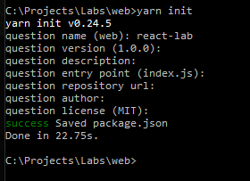

# React
---

This lab demonstrates the fundamental concepts of react and friends.

## Overview

In this lab you will create a simple web interface that will consume the api you created in previous labs.

## Part 1: Setup

Create a new working directory and run `yarn init` there. Follow the instructions through (most aren't super relevant and can be skipped), it should be similar to the following.



You should have a `package.json` present with the properties you added.

> Pay attention to the `package.json`, like a .csproj it pretty much means everything in the web world.

Run `yarn add react react-dom react-redux redux` this will get you the latest versions of packages from NPM, a web equivalent of nuget. Notice how the `package.json` got updated.
Run `yarn add --dev typescript ts-loader webpack webpack-dev-server`.
Add the following scripts into the `package.json`, to enable an easy dev server:

```json
  "scripts": {
    "start": "webpack-dev-server"
  },
```

Add the following content as a file called `tsconfig.json`:

```json
{
  "compilerOptions": {
    "moduleResolution": "node",
    "module": "es6",
    "target": "es6",
    "jsx": "react",
    "allowJs": true
  }
}
```

> This is a config file for typescript, some of which is self-explanatory, other stuff requires a strong understand of javascript

Add the following content as a file called `webpack.config.js`:

```json
module.exports = {
    entry: "./index.tsx",
    output: "./index.js",
    resolve: {
        extensions: [".ts", ".tsx", ".js"]
    },
    module: {
        loaders: [
            { test: /\.tsx?$/, loader: "ts-loader" }
        ]
    }
};
```

> This is a config file for webpack, it takes an input (entry) and an output and runs it through a set of processors (loaders)

## Part 2: Hello world

Add the following file as `index.tsx`:

```js
import React from 'react'
import { render } from 'react-dom'
import App from './components/App'

render(
  <App />,
  document.getElementById('root')
)
```

The import behaves similar to `using` in c#. The `render` function "burns" the app component onto the document's root element.

Add the following file as `index.html`:

```html
<!doctype html>
<html lang="en">
  <body>
    <div id="root"></div>
    <script src="./index.js"></script>
  </body>
</html>
```

Add a `components` folder with a file, `App.tsx`:

```js
import React from "react";

const App = () => <div>Hello World</div>;

export default App;
```

Here is our first component. Component's are small blocks of reusable code that can be consumed multiple times across your application. In this component we are exporting a delegate that returns a *div*. Most components will be comprimised of more than this but should serve a single purpose. Components can be highly nested, so a search panel might *import* an *input* component and a *button* component.

Run `yarn start` in the CWD and navigate to `http://localhost:8080` in a browser of your choice. You should have hello world being printed.

## Part 3: Real shit

Change the `components/App.tsx` to be:

```js
import React from 'react'
import Footer from './Footer'
import AddTodo from '../containers/AddTodo'
import VisibleTodoList from '../containers/VisibleTodoList'

const App = () => 
  <div>
    <AddTodo />
    <VisibleTodoList />
    <Footer />
  </div>

export default App
```

Add a `components/footer.tsx` with the following content:

```js
import React from 'react'
import FilterLink from '../containers/FilterLink'

const Footer = () =>
  <p>
    Show:
    {" "}
    <FilterLink filter="SHOW_ALL">
      All
    </FilterLink>
    {", "}
    <FilterLink filter="SHOW_ACTIVE">
      Active
    </FilterLink>
    {", "}
    <FilterLink filter="SHOW_COMPLETED">
      Completed
    </FilterLink>
  </p>

export default Footer;
```

Add a `components/Todo.tsx` with the following content:

```js
import React, { PropTypes } from 'react'

const Todo = ({ onClick, completed, text }) =>
  <li
    onClick={onClick}
    style={{
      textDecoration: completed ? 'line-through' : 'none'
    }}
  >
    {text}
  </li>

export default Todo;
```

Add a `components/TodoList.tsx` with the following content:

```js
import React, { PropTypes } from 'react'
import Todo from './Todo'

const TodoList = ({ todos, onTodoClick }) =>
  <ul>
    {todos.map(todo =>
      <Todo
        key={todo.id}
        {...todo}
        onClick={() => onTodoClick(todo.id)}
      />
    )}
  </ul>

export default TodoList;
```

Add a `components/Link.tsx` with the following content:

```js
import React, { PropTypes } from 'react'

const Link = ({ active, children, onClick }) => {
  if (active) {
    return <span>{children}</span>
  }

  return (
    <a href="#"
       onClick={e => {
         e.preventDefault()
         onClick()
       }}
    >
      {children}
    </a>
  )
}

export default Link;
```

At this point, it should be obvious that *components* are simple, building blocks for composing an application. And even a trivial application like this consists of multiple. Now we're going to introduce a concept called **containers**. Containers are used to wire-up a store, like redux, to our components. Enabling data to flow through to and from the components without ever knowing where it exists. Think of it like the glue MVC is that can make the back-end work with the front-end.

Really, there's 2 important concepts going on here. Firstly, `mapStateToProps` which maps state from a store to the props that the *component* will consume... easy! Secondly, `mapDispatchToProps` which maps delegates to props. Consider an action like `Submit` to need to be wired up to a button. These 2 delegates are then "glued" by using `connect` with the *Component*

> These are going into the containers folder from now on!!

Add a `containers/TodoList.ts` with the following content:

```js
import { connect } from 'react-redux'
import { toggleTodo } from '../actions'
import TodoList from '../components/TodoList'

const getVisibleTodos = (todos, filter) => {
  switch (filter) {
    case 'SHOW_ALL':
      return todos
    case 'SHOW_COMPLETED':
      return todos.filter(t => t.completed)
    case 'SHOW_ACTIVE':
      return todos.filter(t => !t.completed)
  }
}

const mapStateToProps = (state) => {
  return {
    todos: getVisibleTodos(state.todos, state.visibilityFilter)
  }
}

const mapDispatchToProps = (dispatch) => {
  return {
    onTodoClick: (id) => {
      dispatch(toggleTodo(id))
    }
  }
}

const VisibleTodoList = connect(
  mapStateToProps,
  mapDispatchToProps
)(TodoList)

export default VisibleTodoList
```

Add a `containers/FilterLink.ts` with the following content:

```js
import { connect } from 'react-redux'
import { setVisibilityFilter } from '../actions'
import Link from '../components/Link'

const mapStateToProps = (state, ownProps) => {
  return {
    active: ownProps.filter === state.visibilityFilter
  }
}

const mapDispatchToProps = (dispatch, ownProps) => {
  return {
    onClick: () => {
      dispatch(setVisibilityFilter(ownProps.filter))
    }
  }
}

const FilterLink = connect(
  mapStateToProps,
  mapDispatchToProps
)(Link)

export default FilterLink
```

Add a `containers/AddTodo.tsx` with the following content:

```js
import React from 'react'
import { connect } from 'react-redux'
import { addTodo } from '../actions'

let AddTodo = ({ dispatch }) => {
  let input

  return (
    <div>
      <form onSubmit={e => {
        e.preventDefault()
        if (!input.value.trim()) {
          return
        }
        dispatch(addTodo(input.value))
        input.value = ''
      }}>
        <input ref={node => {
          input = node
        }} />
        <button type="submit">
          Add Todo
        </button>
      </form>
    </div>
  )
}
AddTodo = connect()(AddTodo)

export default AddTodo;
```

> Notice how this is just another component form React's perspective, whether it's rendering html or composing more components is immaterial to React.

We need some actions that the containers can pass into the components;

Add a `action/index.ts` with the following content:

```js
export const addTodo = (text) =>
  async dispatch => {
    let response = await fetch("http://localhost:5000/todos", {
      method: "POST",
      headers: {
        'Content-Type': 'application/json'
      },
      body: JSON.stringify({
        Text: text,
        IsComplete: false
      })
    });

    // Error handling logic would go here...

    let id = response.headers.get("Location").replace("http://localhost:5000/todos/", "");

    dispatch({
      type: 'ADD_TODO',
      id: id,
      text
    });
  }

export const setVisibilityFilter = (filter) => {
  return {
    type: 'SET_VISIBILITY_FILTER',
    filter
  }
}

export const toggleTodo = (id) =>
  async (dispatch, getState) => {
    let state = getState();
    let todo = state.todos.find(x => x.id == id);

    let response = await fetch("http://localhost:5000/todos/" + id, {
      method: "PUT",
      headers: {
        'Content-Type': 'application/json'
      },
      body: JSON.stringify({
        Text: todo.text,
        IsComplete: !todo.completed
      })
    });

    // Error handling logic would go here...

    dispatch({
      type: 'TOGGLE_TODO',
      id
    });
  }
```

See how these are delegates with a single common property, `type`. In Redux, this type field is used to determine what logic to run. Essentially:
1. The component with call these actions with some data
2. The action creators will generate an object with the required property, `type` and the rest of the properties.
3. Redux will route this action to the correct **reducer** (coming up soon)

We're going to need some additional middleware to allow redux to work with async actions. `yarn add redux-thunk` will install the correct package for the job.

Change the `index.tsx` to be:

```js
import React from 'react'
import { render } from 'react-dom'
import { Provider } from 'react-redux'
import { createStore, applyMiddleware  } from 'redux'
import thunk from 'redux-thunk';
import todoApp from './reducers'
import App from './components/App'

let store = createStore(todoApp, applyMiddleware(thunk));

render(
  <Provider store={store}>
    <App />
  </Provider>,
  document.getElementById('root')
)
```

> You should have one last error about `'./reducers'`

## Part 3: Reducers

Reducers are awesome. Essentially you take a slice of the store you care about and, given an action, return a new store. The key here is that you never modify the original store and you never have any side effects. Reducers should only be pure and return a new store. If you follow this advice you get an application where you can replay/fast forward through different states... Awesome!

Add a `reducers/todos.ts` with the following content:

```js
import Todo from "../models/Todo";

const todo = (state = new Todo(null, null), action) : Todo => {
  switch (action.type) {
    case 'ADD_TODO':
      return new Todo(action.id, action.text);
    case 'TOGGLE_TODO':
      if (state.id !== action.id) {
        return state
      }

      return Object.assign({}, state, {
        completed: !state.completed
      })

    default:
      return state
  }
}

const todos = (state = new Array<Todo>(), action) => {
  switch (action.type) {
    case 'ADD_TODO':
      return [
        ...state,
        todo(undefined, action)
      ]
    case 'TOGGLE_TODO':
      return state.map(t =>
        todo(t, action)
      )
    default:
      return state
  }
}

export default todos
```

Add a `reducers/index.ts` with the following content:

```js
import { combineReducers } from 'redux'
import todos from './todos'
import visibilityFilter from './visibilityFilter'

const todoApp = combineReducers({
  todos,
  visibilityFilter
})

export default todoApp
```

Add a `reducers/visibilityFilter.ts` with the following content:

```js
const visibilityFilter = (state = 'SHOW_ALL', action) => {
  switch (action.type) {
    case 'SET_VISIBILITY_FILTER':
      return action.filter
    default:
      return state
  }
}

export default visibilityFilter
```

Add a `models/Todo.ts` with the following content:

```js
export default class Todo {
    id: string;
    text: string;
    completed: boolean;
    constructor(id: string, text: string) {
        this.id = id;
        this.text = text;
        this.completed = false;
    }
}
```

This will give us some stronger typing support throughout.

> In our MVC app, we need to add `services.AddCors();` and 

```c#
app.UseCors(builder =>
{
    builder.AllowAnyMethod();
    builder.AllowAnyHeader();
    builder.WithExposedHeaders("Location");
    builder.WithOrigins("http://localhost:8080");
});
```

to the appropriate places. CORS is an important security consideration, you can read more [here](https://en.wikipedia.org/wiki/Cross-origin_resource_sharing)

## Part 4: ...what next?

You've got the bare minimum set up here for a reactive application. If you want to learn more try one (or more) of the following challenges:

1. Add a GET for all the TODOs, such that when you refresh your browser the todos are pulled programmatically from the server.
2. Add boostrap or another style framework and begin styling your components (for bonus points: think about how each component is reusable and bring in **only** the styles necessary for it)
3. Add client side routing, such as react router!
4. Add a reducer for complex view logic